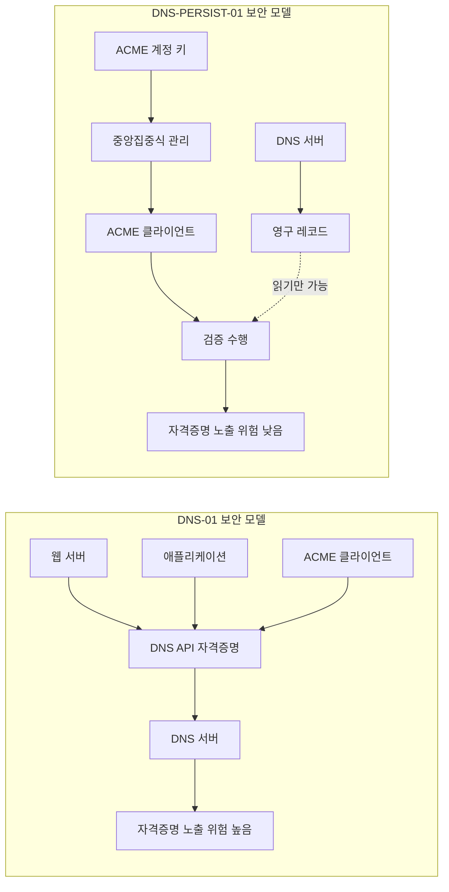
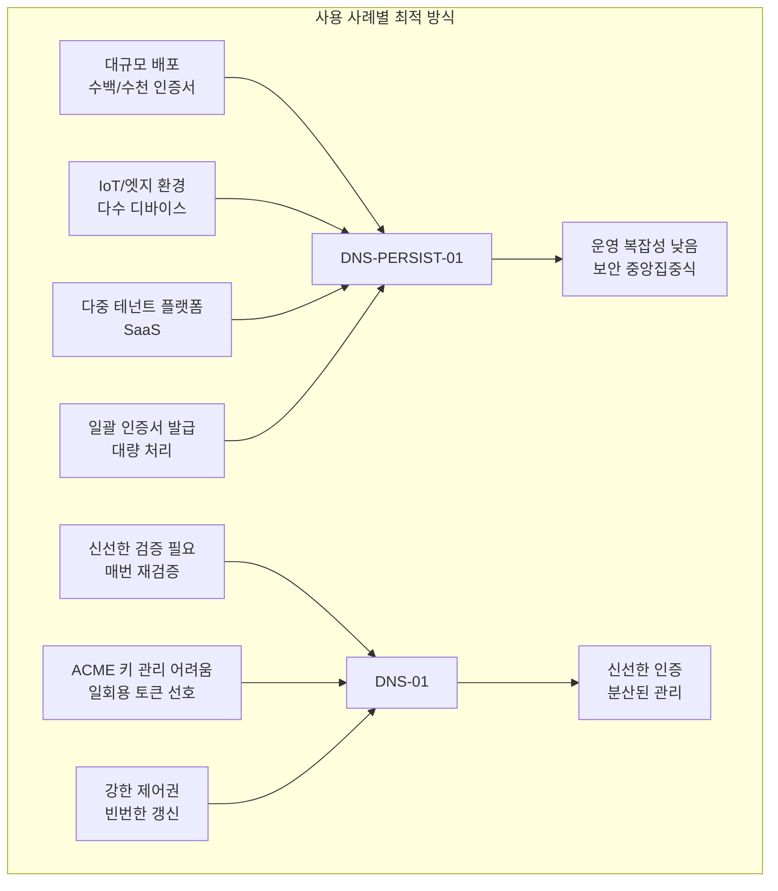

Let's Encrypt는 최근 새로운 ACME 챌린지 타입인 DNS-PERSIST-01을 발표했습니다. 이 새로운 방식은 기존의 DNS-01 챌린지가 가지고 있던 운영상의 복잡성을 크게 줄이면서도 충분한 보안을 유지하는 혁신적인 접근 방식을 제시합니다. 이제부터 이 새로운 방식이 기존 방식과 어떻게 다르며 어떤 이점이 있는지 자세히 살펴보겠습니다.

## 기존 DNS-01 방식의 작동 원리와 문제점

DNS-01 챌린지는 도메인에 대한 제어권을 증명하기 위해 DNS를 활용하는 검증 방식입니다. 이 방식의 작동 방식은 매우 직관적입니다. 먼저 Let's Encrypt 서버가 일회용 토큰을 생성합니다. 그 다음 ACME 클라이언트는 이 토큰을 포함한 TXT 레코드를 `_acme-challenge.<도메인>` 위치에 게시해야 합니다. Let's Encrypt는 DNS를 조회하여 토큰이 일치하는지 확인하고, 일치하면 도메인에 대한 제어권을 인정합니다. 이 과정은 인증서를 갱신할 때마다 반복됩니다.

DNS-01 방식이 제공하는 몇 가지 장점이 있습니다. 첫째, 와일드카드 인증서를 발급할 수 있다는 점입니다. HTTP-01 방식으로는 불가능하지만 DNS-01은 와일드카드 도메인에 대한 인증서 발급을 지원합니다. 둘째, 여러 개의 웹 서버가 있는 환경에서도 잘 작동합니다. 각 서버가 따로 응답을 준비할 필요가 없기 때문입니다. 셋째, 인터넷에 노출되지 않은 도메인도 검증할 수 있습니다. 웹 서버가 공개 인터넷에 노출될 필요가 없기 때문입니다.

그러나 DNS-01 방식은 실무에서 운영할 때 상당한 어려움을 야기합니다. 가장 심각한 문제는 DNS API 자격증명의 분산입니다. DNS 업데이트 권한이 발급 파이프라인의 여러 곳에 분산되어야 하므로, 웹 서버나 애플리케이션 서버가 해킹되면 DNS 자격증명도 함께 노출될 위험이 있습니다. 또한 DNS 전파 지연이 발생합니다. DNS 업데이트 후 전파되기를 기다려야 하므로 인증서 발급 프로세스가 지연될 수 있습니다. 대규모 배포 환경에서는 하루에 여러 번의 DNS 수정이 필요하기도 합니다. 수백 개 또는 수천 개의 인증서를 관리해야 하는 경우, 매번 새로운 토큰을 생성하고 DNS를 업데이트해야 한다는 것은 상당한 운영 부담이 됩니다.

## DNS-PERSIST-01의 등장과 핵심 개념

DNS-PERSIST-01은 이러한 문제들을 근본적으로 해결하기 위해 새로운 철학을 도입합니다. 기존의 "매번 새로운 토큰으로 검증"이라는 개념을 버리고 "한 번의 영구 인증 레코드"라는 개념을 도입한 것입니다.

두 방식의 차이를 다음 다이어그램으로 시각화할 수 있습니다.

```mermaid
graph TD
    subgraph DNS01["DNS-01: 매번 새로운 토큰"]
        A1["인증서 발급 요청"] --> A2["토큰 생성"]
        A2 --> A3["DNS에 TXT 레코드 추가"]
        A3 --> A4["DNS 전파 대기"]
        A4 --> A5["검증 완료"]
        A5 --> A6["인증서 발급"]
        A6 --> A7["TXT 레코드 삭제"]
        A7 --> A8["갱신 시 A1부터 반복"]
    end
    
    subgraph DNSPERSIST["DNS-PERSIST-01: 한 번의 영구 레코드"]
        B1["초기 설정"] --> B2["영구 레코드를 DNS에 추가"]
        B2 --> B3["이후 갱신"]
        B3 --> B4["레코드는 변경 없음"]
        B4 --> B5["단순 검증만 수행"]
        B5 --> B6["인증서 갱신 완료"]
        B6 --> B7["무한 재사용"]
    end
```



DNS-PERSIST-01을 설정하는 방식은 매우 간단합니다. 도메인의 DNS에 한 번만 다음과 같은 레코드를 추가하면 됩니다.

```
_validation-persist.example.com. IN TXT (
  "letsencrypt.org;"
  " accounturi=https://acme-v02.api.letsencrypt.org/acme/acct/1234567890"
)
```

이 레코드가 DNS에 존재하는 순간부터 매우 획기적인 변화가 일어납니다. 초기 발급 시에만 한 번 DNS를 변경하면 되고, 이후의 모든 갱신은 이 레코드를 재사용합니다. 가장 중요한 점은 DNS 변경이 발급 프로세스에서 완전히 제거된다는 것입니다. 초기 설정 후에는 ACME 클라이언트가 단순히 이 영구 레코드가 존재한다는 것을 확인하기만 하면 되므로, DNS API 자격증명을 애플리케이션에 배포할 필요가 없습니다.

## 보안 철학의 전환

DNS-PERSIST-01은 보안의 초점을 근본적으로 바꿉니다. DNS-01에서는 DNS API 접근 권한이 민감한 자산이었습니다. 이 자격증명이 여러 곳에 분산되어야 했으므로, 공격 표면이 넓었습니다. 반면 DNS-PERSIST-01에서는 ACME 계정 키가 중앙집중식으로 관리됩니다. DNS에 영구 레코드가 있으면 되므로, ACME 클라이언트는 ACME 계정 키만 안전하게 보관하면 됩니다.

이것은 명확한 트레이드오프입니다. DNS-01은 매번 새로운 토큰으로 검증하므로 "신선한" 인증을 제공합니다. 즉, 매번 현재 시점에 도메인을 제어하고 있다는 증거를 제시합니다. 반면 DNS-PERSIST-01은 과거에 한 번 설정한 레코드를 계속 사용하므로 인증의 신선도가 낮습니다. 그러나 이 트레이드오프는 대부분의 사용 사례에서 받아들여질 만한 가치를 제공합니다.

보안 측면의 차이를 다음 다이어그램으로 이해할 수 있습니다.



## DNS-PERSIST-01의 고급 기능

DNS-PERSIST-01은 단순한 기능뿐만 아니라 다양한 고급 옵션도 제공합니다. 첫 번째는 와일드카드 인증서 지원입니다. 기본 설정에서는 특정 도메인에만 적용되지만, policy 파라미터를 추가하면 와일드카드 인증서도 발급할 수 있습니다.

```
_validation-persist.example.com. IN TXT (
  "letsencrypt.org;"
  " accounturi=https://acme-v02.api.letsencrypt.org/acme/acct/1234567890;"
  " policy=wildcard"
)
```

이렇게 설정하면 example.com 자체뿐만 아니라 *.example.com 형태의 와일드카드 인증서와 모든 하위 도메인에 대한 인증도 가능해집니다.

두 번째 고급 기능은 선택적 만료 시간 설정입니다. 영구 레코드는 기본적으로 무한정 유효하지만, 선택적으로 만료 시간을 설정할 수 있습니다. persistUntil 파라미터를 사용하여 Unix 타임스탬프 형태로 만료 시간을 지정할 수 있습니다.

```
_validation-persist.example.com. IN TXT (
  "letsencrypt.org;"
  " accounturi=...;"
  " persistUntil=1767225600"
)
```

이 기능을 사용하면 자동으로 권한이 만료되므로 정기적인 갱신을 강제할 수 있습니다. 다만 주의해야 할 점은 만료 시간이 지나기 전에 반드시 레코드를 갱신하거나 교체해야 한다는 것입니다. 자동 알람 설정을 권장합니다.

세 번째 기능은 여러 CA의 동시 승인입니다. 여러 개의 CA로부터 인증서를 발급받아야 하는 경우, `_validation-persist` 이름 아래에 여러 개의 TXT 레코드를 게시할 수 있습니다. 각 CA는 자신의 발급자 도메인명과 매칭되는 레코드만 인식하므로 충돌이 발생하지 않습니다.

## 실제 적용 사례와 최적 시나리오

DNS-PERSIST-01은 모든 상황에 최적이 아닙니다. 특정한 상황에서 특히 가치를 발휘합니다. 다음 다이어그램은 여러 환경에서 각 방식의 적합성을 보여줍니다.



첫째는 대규모 배포 시스템입니다. 수백 개 또는 수천 개의 인증서를 관리해야 하는 환경에서 DNS 변경을 설정 단계로 제한할 수 있다는 것은 엄청난 이점입니다. 운영 복잡성이 크게 감소하고, 갱신 과정이 훨씬 간단해집니다.

둘째는 IoT나 엣지 디바이스 환경입니다. 수많은 디바이스에서 각각 인증서를 발급받아야 하는 경우가 있습니다. 이런 환경에서 중앙의 ACME 계정으로 관리하고 각 디바이스에는 ACME 키만 배포할 수 있다면, 보안성과 관리성이 모두 향상됩니다.

셋째는 다중 테넌트 플랫폼입니다. SaaS 플랫폼에서 각 테넌트가 자신의 도메인에 대한 인증서를 필요로 하는 경우가 있습니다. DNS-PERSIST-01을 사용하면 플랫폼은 단일 ACME 계정으로 모든 테넌트의 인증서를 관리할 수 있습니다.

넷째는 일괄 인증서 작업입니다. 한 번에 많은 수의 인증서를 발급해야 하는 경우, DNS 전파 지연을 기다릴 수 없는 상황이 발생합니다. DNS-PERSIST-01은 이런 상황에 매우 적합합니다.

그렇다면 DNS-01을 계속 사용해야 하는 경우는 언제일까요? 첫째는 최대한 신선한 인증 증명이 필요한 경우입니다. 매번 현재 시점에 도메인을 제어하고 있다는 증거가 필요하다면 DNS-01이 더 나을 수 있습니다. 둘째는 ACME 계정 키의 장기 관리가 어려운 경우입니다. 일회용 토큰이 더 안전하다고 판단될 수 있습니다. 셋째는 검증 레코드의 빈번한 변경이 필요한 경우입니다. 더 강한 제어권을 원한다면 매번의 갱신이 더 나을 수 있습니다.

## 산업 표준화와 출시 일정

DNS-PERSIST-01은 단순한 Let's Encrypt의 독자적인 구현이 아닙니다. 이 방식은 이미 산업 표준화 과정을 거쳤습니다. CA/Browser Forum의 ballot SC-088v3는 2025년 10월에 만장일치로 통과되었습니다. 동시에 IETF ACME 워킹 그룹도 해당 드래프트를 채택했습니다.

현재의 구현 상황은 다음과 같습니다. 먼저 Let's Encrypt의 테스트용 CA인 Pebble에 지원이 추가되었으므로, 개발자들은 이미 이 기능을 테스트할 수 있습니다. lego-cli 클라이언트의 구현도 진행 중입니다. Staging 환경에 대한 배포는 2026년 Q1 말로 예정되어 있으며, 프로덕션 환경에 대한 배포는 2026년 Q2 상반기에 이루어질 것으로 예상됩니다.

## 결론: 새로운 패러다임의 의미

DNS-PERSIST-01의 등장은 SSL/TLS 인증서 발급 방식의 새로운 패러다임을 제시합니다. 기존의 "매번 신선한 증명"에서 "한 번의 영구적 승인"으로의 전환은 단순한 기술적 개선이 아니라 운영 철학의 변화입니다.

이 새로운 방식의 핵심 가치는 다음과 같이 요약할 수 있습니다. 첫째, DNS 변경을 초기 설정 단계로 제한함으로써 운영 복잡성을 대폭 감소시킵니다. 둘째, DNS API 자격증명의 분산을 최소화함으로써 보안 표면을 줄입니다. 셋째, ACME 계정 키의 중앙집중식 관리로 보안을 강화합니다. 넷째, 대규모 배포, IoT, 다중 테넌트, 일괄 작업 같은 현대적 인프라 요구사항에 최적화되어 있습니다.

DNS-PERSIST-01은 특히 현대의 클라우드 네이티브 환경, Kubernetes 기반 배포, 마이크로서비스 아키텍처에서 큰 가치를 제공할 것으로 예상됩니다. 기존 DNS-01 방식이 계속 유용하겠지만, 많은 조직에서는 이 새로운 방식으로 전환할 때 상당한 운영상 이점을 얻을 수 있을 것입니다.

---

태그: #letsencrypt #acme #dns #보안 #인증서 #devops

작성일: 2026-02-19
출처: Let's Encrypt 공식 블로그 (2026-02-18)
