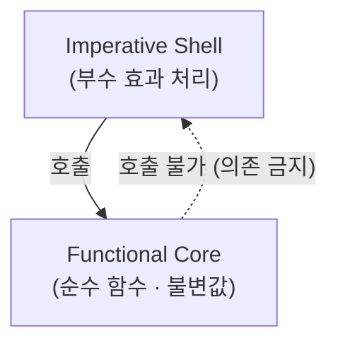
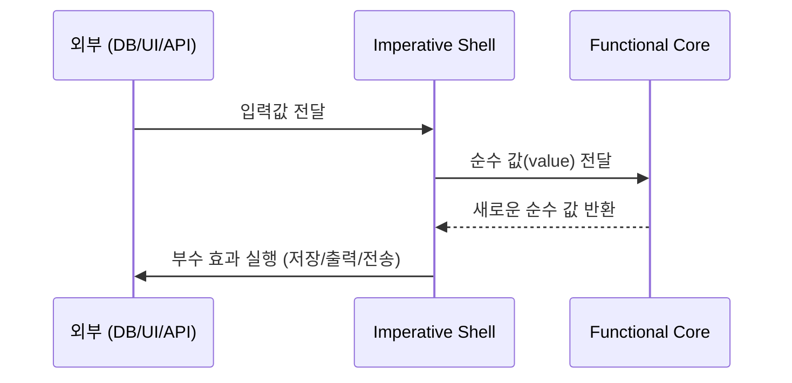
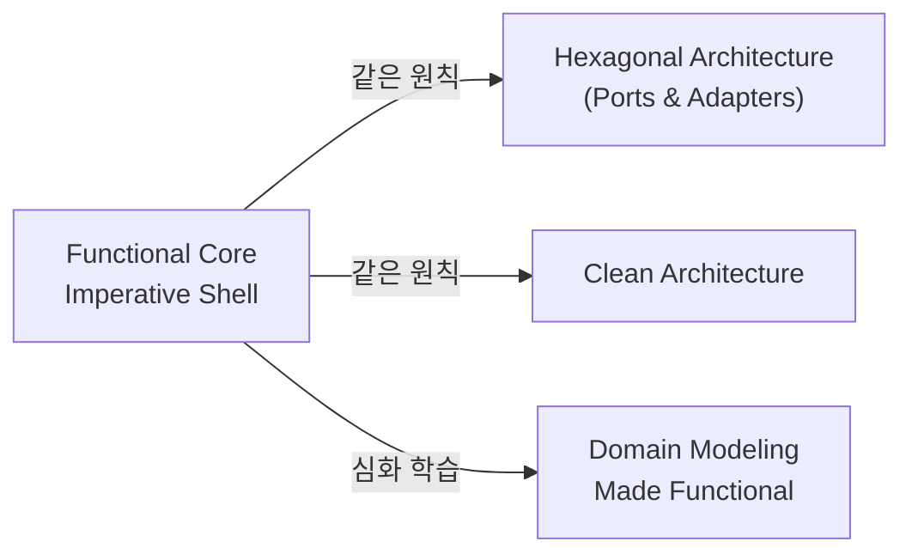

# 1. 개요

Gary Bernhardt가 고안한 아키텍처 패턴. 함수형 프로그래밍과 명령형 프로그래밍 각각의 장점을 살리기 위해 코드를 두 계층으로 명확히 분리함.

- **Gary Bernhardt의 Screencast** (Destroy All Software, Season 4) — [링크](https://www.destroyallsoftware.com/screencasts/catalog/functional-core-imperative-shell)
- **"Boundaries" 강연** (SCNA 2012) — 컴포넌트 경계에서 단순한 값(simple values)을 사용하는 원칙 — [링크](https://www.destroyallsoftware.com/talks/boundaries)

# 2. 두 계층의 정의

| 구분 | Functional Core | Imperative Shell |
|------|----------------|-----------------|
| 역할 | 비즈니스 로직 | I/O, DB, UI, 외부 API |
| 스타일 | 함수형 | 명령형 |
| 부수 효과 | 없음 | 있음 |
| 값 | 불변(immutable) | 가변(mutable) |
| 테스트 | 단위 테스트만으로 충분 | 통합 테스트 필요 |
| 비중 | 최대화 | 최소화 |



# 3. 핵심 의존성 규칙

> **Shell은 Core를 호출할 수 있지만, Core는 Shell을 호출할 수 없고 Shell의 존재를 알지 못함.**

의문이 있을 때는 함수형으로 작성해서 Core에 배치하는 것이 원칙. 명령형 코드를 최소화할수록 이 패턴의 효과가 극대화됨.

# 4. 데이터 흐름



1. Shell이 외부에서 데이터를 읽어옴 (DB 쿼리, HTTP 요청 등)
2. 읽어온 값을 Core에 전달
3. Core는 순수 함수로 처리 후 새로운 값 반환
4. Shell이 반환값으로 부수 효과 실행 (DB 저장, 화면 출력 등)

# 5. TypeScript 구현 예시

kenneth-lange의 [TypeScript 데모](https://github.com/kenneth-lange/ts-functional-core-imperative-shell) 기반.

**core.ts — Functional Core**

```typescript
// 상태별 독립 타입 (Tagged Union)
type DraftPost = {
  status: 'draft'
  title: string
  content: string
}
type PublishedPost = {
  status: 'published'
  title: string
  content: string
  publishedAt: Date
}

// 순수 함수: 부수 효과 없음
function publishPost(draft: DraftPost): PublishedPost {
  return { ...draft, status: 'published', publishedAt: new Date() }
}
```

**shell.ts — Imperative Shell**

```typescript
// 부수 효과를 한 곳에 집중
async function handlePublish(postId: string): Promise<void> {
  const draft = await db.findPost(postId)    // I/O: 읽기
  const published = publishPost(draft)        // Core 호출
  await db.savePost(published)               // I/O: 쓰기
  console.log('Published:', published.title)  // I/O: 출력
}
```

> Core에서 Tagged Union으로 상태를 분리하면 **불가능한 상태 전환을 컴파일 타임에 차단**할 수 있음.

# 6. 유사 패턴과의 관계



세 패턴 모두 **비즈니스 로직을 외부 의존성(I/O, DB, UI)으로부터 격리**한다는 동일한 원칙을 공유함. FCIS는 함수형 관점에서 이를 가장 단순하게 표현한 것.

# 7. 알아두면 좋은 내용

- **테스트 피라미드와의 연관**: Core는 Mock 없이 단위 테스트 가능 → 통합 테스트 범위가 자연스럽게 줄어듦
- **설계 판단 기준**: 어떤 계층에 둘지 모를 때는 Core에 두는 게 원칙. Shell에 로직이 들어가는 순간 테스트 비용이 증가함
- **Shell은 얇게 유지**: Shell은 I/O 호출과 Core 호출의 연결 역할에 집중해야 함. 비즈니스 판단은 모두 Core로
- **불변 값을 경계로 사용**: 컴포넌트 간 데이터 전달 시 복잡한 객체 대신 단순한 불변 값(simple values)을 사용하는 것이 "Boundaries" 강연의 핵심 메시지
