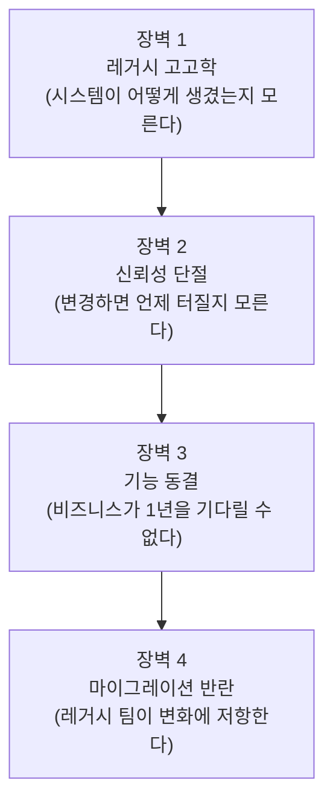
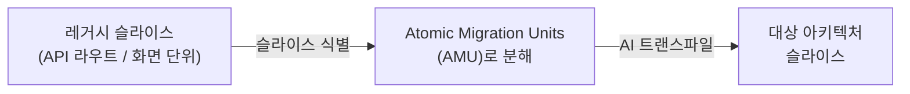
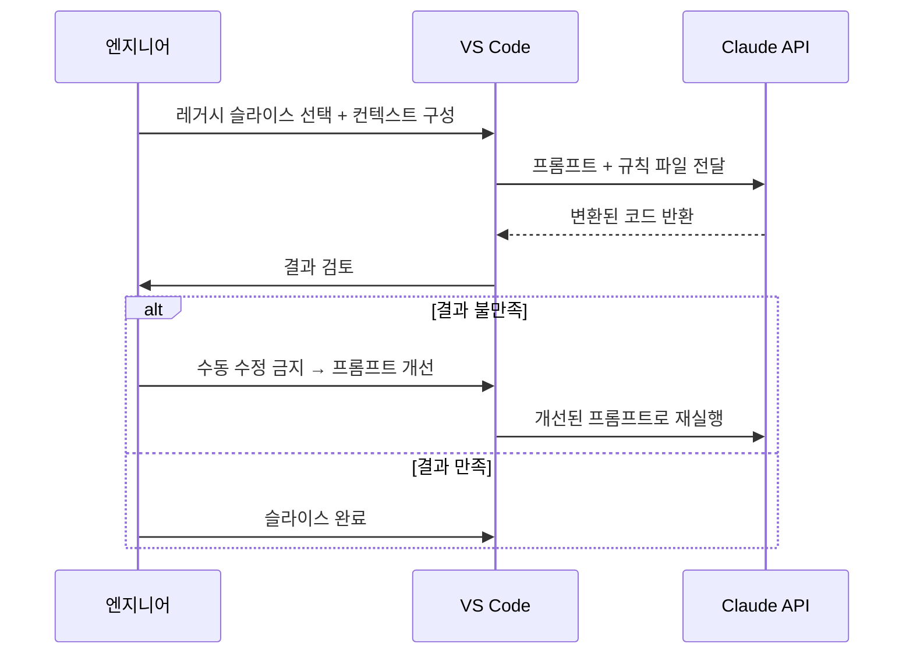

<iframe width="560" height="315" src="https://www.youtube.com/embed/Vbm20F-q-ak?si=3ro-kZdfD6aMbsxI" title="YouTube video player" frameborder="0" allow="accelerometer; autoplay; clipboard-write; encrypted-media; gyroscope; picture-in-picture; web-share" referrerpolicy="strict-origin-when-cross-origin" allowfullscreen></iframe>

발표자: Fabrice Bernhard (Theodo 공동창업자)
컨퍼런스: DDD Europe 2025

# 1. 왜 레거시 현대화가 시급한가

Fabrice는 강연을 충격적인 사례로 시작한다. 2024년 Citigroup이 고객 계좌에 실수로 **81조 달러**를 입금한 사건인데, 원인은 단순했다. 오퍼레이터들이 금액 필드에 0이 15개 미리 채워진 레거시 시스템을 써야 했고, 누군가 그 0을 지우는 걸 깜빡한 것이다. 같은 해에만 이런 실수 이체가 10건 발생했다.

이 문제는 은행만의 이야기가 아니다. 병원, 항공관제 시스템 등 곳곳에 레거시가 만연해 있고, 미국 FAA 보고서에 따르면 시스템의 절반 이상이 위기 상태다. 추정되는 COBOL 코드만 8,000억 줄에 달한다.

Fabrice가 꼽는 현대화가 **지금 특히 시급한 이유**는 세 가지다. 첫째, AI로 사이버 공격이 빠르게 고도화되고 있다. 둘째, 규제 기관의 압박이 강해지고 있다. 셋째, 그리고 가장 결정적으로, **90년대~2000년대에 이 시스템들을 만든 엔지니어들이 지금 60대가 되어 대거 은퇴하고 있다**. 시스템을 이해하는 사람이 사라지기 전에 현대화해야 한다는 것이다.

> 현대화 프로젝트의 75%가 실패한다는 통계가 있음. 단, 이 수치는 이후 IBM에 인수된 기관에서 나온 것이므로 편향 가능성 있음.

# 2. 케이스 스터디: 막힌 마이그레이션

Fabrice는 2008년부터 레거시 현대화를 해온 인물이다. 그가 공동창업한 Theodo는 현재 700명 규모이고, 지난 2년간 AI를 레거시 현대화에 어떻게 활용할 수 있는지 R&D에 집중해왔다.

강연의 핵심 케이스 스터디는 **인수합병으로 성장한 기업**의 사례다. 여러 국가에 흩어진 시스템들을 하나의 유럽 전역 모듈형 시스템으로 통합하려 했는데, 시작하자마자 팀이 완전히 막혀버렸다. 실제 시스템이 예상과 전혀 달랐기 때문이다.

코드베이스를 수작업으로 매핑하려 했더니 며칠을 써도 **5%밖에 완료하지 못하고 중단**해야 했다. Dependency Cruiser 같은 자동 의존성 분석 도구를 써봤지만 소용없었다. 문제는 이 시스템이 LoopBack 프레임워크를 쓰고 있었는데, 이 프레임워크의 "마법 같은(magical)" 기능들이 만들어내는 **암묵적 의존성**은 일반 정적 분석으로는 추적 자체가 불가능했다. 코드를 아무리 들여다봐도 전체 그림이 잡히지 않는 상황이었다.

## 2.1. 레거시 현대화의 4가지 장벽

이 경험에서 Fabrice는 레거시 현대화를 가로막는 장벽이 늘 비슷한 네 가지라는 점을 발견한다.

이 네 장벽을 풀어나가는 것이 이후 강연의 뼈대가 된다.

# 3. AI로 의존성 그래프 만들기 (장벽 1 해결)

막다른 상황에서 Fabrice가 CTO와 나눈 대화가 전환점이 됐다. 당시 Theodo에서 네이티브 앱을 React Native로 전환하는 데 AI를 활용해 **3배 빠른** 속도를 냈던 경험을 공유했고, 함께 실험해보기로 했다.

아이디어는 간단했다. 정적 분석 도구가 놓치는 프레임워크의 암묵적 의존성을 **AI 프롬프트로 추적하는 스크립트를 만들자**는 것이다. 결과는 JSON 의존성 파일로 뽑고, 이를 **Neo4j 그래프 DB**에 넣어 시각화했다. 특히 Neo4j의 **물리 엔진(physical engine)** 이 빛을 발했는데, 노드들이 서로 당기고 밀리는 물리 시뮬레이션을 통해 코드베이스의 결합도를 직관적으로 볼 수 있었다.

> 정적 분석보다 덜 결정론적(deterministic)이지만, 그 유연성 덕분에 프레임워크 특유의 마법적 의존성까지 잡아낼 수 있음.

이 그래프의 활용은 단순한 시각화에서 끝나지 않는다. 각 API 엔드포인트나 화면별로 "이걸 마이그레이션하려면 어떤 파일들이 함께 움직여야 하는가"를 파악하는 데, 즉 **수직 슬라이스(vertical slices)를 식별**하는 데 핵심적으로 쓰인다.

# 4. Atomic Migration Patterns

의존성 그래프로 슬라이스를 식별했다면, 다음 질문은 "그 슬라이스를 어떻게 대상 아키텍처로 옮기는가"다. 여기서 Fabrice가 제안하는 개념이 **Atomic Migration Pattern**이다.

전형적인 슬라이스의 형태를 정의하고, 그것이 대상 아키텍처에서는 어떻게 보여야 하는지를 설계하면, 원본에서 목표로 가는 "경로(trajectory)"를 그릴 수 있다. 이 경로의 각 단계가 **Atomic Migration Unit(AMU)** 이다.

AMU의 크기는 프로젝트마다 다르다. 잘 설계된 VIPER 아키텍처를 React Native로 옮길 때는 각 레이어 파일 하나가 AMU 하나가 됐다. 2000년대 플랫폼처럼 1백만 줄짜리 XML을 통째로 내보내야 하는 경우에는 그 안의 SQL 쿼리 단위로 쪼개야 했다.

> AMU 크기의 원칙: LLM이 잘 번역할 만큼 **작게**, 하지만 의미 있는 작업 단위가 될 만큼 **크게**.

# 5. AI 트랜스파일 반복 루프

AMU별로 AI 프롬프트를 작성해 변환을 자동화하는 것이 이 방법의 핵심이다. 하지만 처음부터 잘 되진 않는다. ChatGPT나 Claude에 레거시 코드를 넣으면 80% 수준의 결과는 금방 얻을 수 있지만, **재사용 가능한 98% 수준**까지 올리려면 수 일의 반복 작업이 필요하다.

여기서 Fabrice가 강조하는 **절대 원칙**이 하나 있다. 결과가 마음에 안 들면 코드를 손으로 고치지 말고, **프롬프트로 돌아가서 수정한 뒤 처음부터 다시 실행**하라는 것이다. 수동 교정은 그 슬라이스 하나에만 적용되지만, 프롬프트를 고치면 이후 모든 슬라이스에 효과가 이어진다. 또한 수동 교정의 유혹에 빠지면 무엇이 효과적인지 배울 수 없다.

이 반복을 거쳐 나오는 결과물이 **40-50줄짜리 규칙 파일**이다. 내용이 매우 구체적인 이유가 흥미롭다. LLM은 이미 일반적인 케이스는 다 처리할 줄 안다. 규칙 파일에 남는 건 그 프로젝트 고유의 특수 케이스이거나, 팀이 명시적으로 정한 기술 표준이다. 그리고 이 파일을 GitHub Copilot의 컨텍스트로 등록하면 팀 전체가 같은 기준으로 코딩하게 되어 **마이그레이션 반란(장벽 4)** 문제도 함께 완화된다.

VS Code 플러그인을 통해 IDE 안에서 직접 실행할 수 있도록 만든 것도 중요한 설계 결정이다. 엔지니어가 관련 파일을 직접 컨텍스트에 추가하고, 프롬프트 실행 로그를 바로 확인하며, 출력 결과를 즉시 검토할 수 있도록 **엔지니어에게 전체 제어권**을 준다.

# 6. 신뢰성 확보 (장벽 2 해결)

기술을 완전히 바꾸면 필연적으로 "big bang" 순간이 온다. 레거시를 건드리지 않으면 리스크가 낮지만, 건드리는 순간 언제 터질지 모른다는 불안이 생긴다.

Fabrice의 팀은 이 문제를 **인터페이스 레벨의 동등성 테스트(equivalence tests)** 로 접근한다. 코드가 아닌 외부 동작 기준으로, 레거시 앱과 신규 앱이 같은 입력에 같은 출력을 내는지를 비교한다. 실제로 이 과정에서 현대화 버전의 버그가 레거시 버전에도 똑같이 존재했음이 밝혀지는 경우도 있었다.

> 아직 완전히 쉽지는 않으며, Fabrice 본인도 계속 개선 중인 영역이라고 솔직하게 인정함.

# 7. 실제 결과

| 지표 | 수치 |
|------|------|
| 전체 마이그레이션 속도 향상 | **4배** |
| 1번째 슬라이스 (프롬프트 제작 포함) | 8일 |
| 2번째 슬라이스 | 5일 |
| 3번째 슬라이스 | 3일 |
| 안정화 이후 평균 | **1.5일/슬라이스** |

흥미로운 역설이 있다. 4배 빠르게 했는데도 **예정 기간 내 완료**했다. 이유는 프로젝트 규모를 애초에 4배 과소평가했기 때문이다. AI가 없었다면 예정 기간의 4배가 걸렸을 것이라는 얘기다.

속도에 한계가 있는 이유도 Fabrice는 솔직하게 말한다. 현재는 모든 PR을 직접 리뷰하고 무엇이 마이그레이션되는지 이해하는 수준을 유지하고 있다. 그래서 3-4배지 20배가 아니다.

# 8. Claude를 선택한 이유와 주의사항

모든 테스트에서 Claude를 선택한 이유는 하나다. **특정 지시사항을 코드에서 가장 일관되게 따른다**는 것이다. Anthropic이 초기부터 챗봇의 이상한 발화를 막기 위해 만든 **헌법적 레이어(constitutional layer)** 전략이, 레거시 현대화에서 "정확한 규칙을 정확하게 따르는" 용도로도 잘 작동한다.

> "나는 매우 스마트하고 유연한 regex를 만들고 싶다 — Claude가 이를 잘 해낸다."

단, **에이전트 모드(agentic mode)는 주의**가 필요하다. 컨텍스트 윈도우가 포화되면 Claude가 아무런 경고 없이 메모리의 일부를 조용히 삭제해버린다. 그 결과 잘 돌아가던 작업이 갑자기 이상하게 동작하기 시작한다. Fabrice 팀은 이 문제를 LLM API 호출을 직접 스크립팅하고 컨텍스트 윈도우 크기를 명시적으로 제어하는 방식으로 해결했다.

# 9. Lean 원칙과 팀 학습

Fabrice는 이 접근법 전체를 Lean 제조업의 원칙과 연결한다. **Jidoka** — 결함이 발생하면 멈추고 원인을 분석한다. AI 작업에서 실패한 프롬프트를 바로 수동으로 고치고 싶은 유혹이 있지만, 그러면 배움이 없다. 멈추고, 왜 프롬프트가 실패했는지 분석하고, 코드를 전부 되돌린 뒤, 프롬프트를 개선하고 다시 실행해야 한다.

팀 학습은 **역 도장(Reverse Dojo)** 방식으로 체계화한다. 주간 세션에서 팀원들이 자신이 쓴 프롬프트를 가져오면, 전문가가 표준에 따라 리뷰하고 핵심 인사이트를 전체에 교육한다. 이 과정에서 나온 학습은 "스탠다드" 문서에 축적되어 규칙 파일로 이어진다.

# 10. 알아두면 좋은 내용

- **문서화는 목적이 있을 때만**: "무엇을 위한 문서인지 모르면 항상 불만족스럽다." 레거시 전체를 이해하려고 문서화하는 것은 낭비. 마이그레이션 대상 슬라이스를 이해하는 데 필요한 것만 문서화하는 게 원칙
- **프레임워크별 난이도 차이**: Angular 이전이 React보다 쉬움. Angular는 의견이 명확해 LLM이 잘 학습해 있음. React는 같은 것을 구현하는 방법이 너무 많아, 명시하지 않으면 매번 다른 라우터를 사용하는 등 일관성이 떨어짐
- **비즈니스 모델 변경도 가능**: 이 접근법은 목표 아키텍처를 바꿔 잡는 것 자체는 가능하므로, 단순 기술 이전을 넘어 리아키텍처링도 할 수 있음. 다만 진짜 어려운 것은 기술이 아니라 기능 변경 시 의사결정 지연
