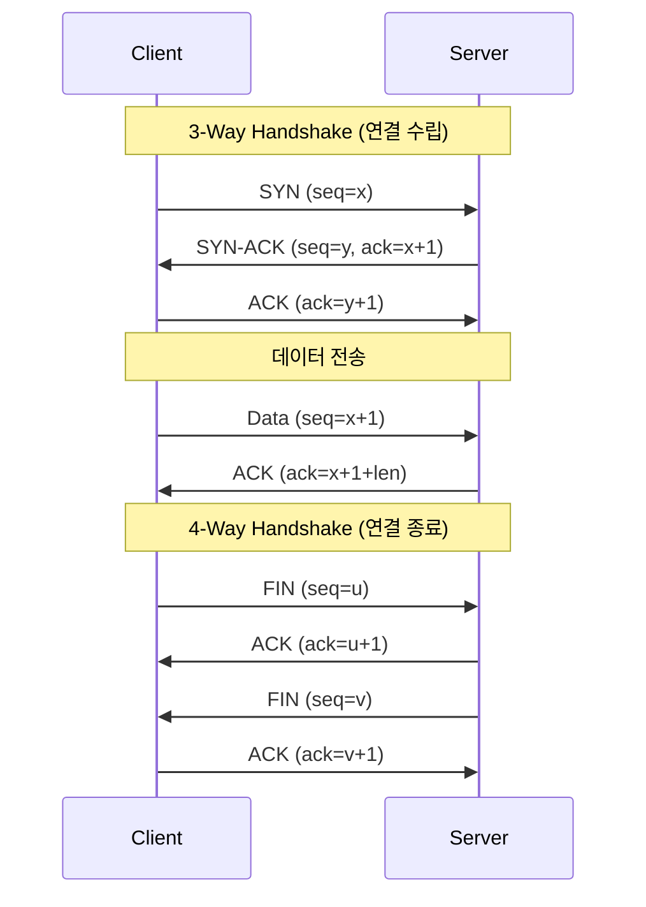

# TCP 패킷 순서

## 3-Way Handshake (연결 수립)

## TCP 플래그

**SYN (Synchronize)**
연결 수립 요청 시 사용. 최초 seq 번호를 상대방에게 알린다. 3-way handshake의 첫 단계에서만 사용되며, 이후 패킷에서는 설정되지 않는다.

**ACK (Acknowledgment)**
수신 확인. ack 필드의 값이 유효함을 나타낸다. 연결 수립 이후 거의 모든 패킷에 설정된다. "다음에 이 seq 번호부터 받겠다"는 의미.

**FIN (Finish)**
연결 종료 요청. 더 이상 보낼 데이터가 없음을 알린다. FIN을 보낸 쪽은 수신은 계속할 수 있으므로, 양방향 종료를 위해 4-way handshake가 필요하다.

**RST (Reset)**
연결을 즉시 강제 종료. 비정상적인 상황(존재하지 않는 포트로 접근, 오류 등)에서 사용. FIN과 달리 handshake 없이 즉각 종료한다.

**PSH (Push)**
수신 버퍼에 데이터를 쌓지 말고 즉시 애플리케이션에 전달하도록 요청. 지연 없이 데이터를 빠르게 올려보내야 할 때 사용.

**URG (Urgent)**
긴급 데이터가 포함되어 있음을 알림. URG 포인터가 가리키는 위치까지의 데이터를 우선 처리한다. 현재는 거의 사용되지 않는다.
