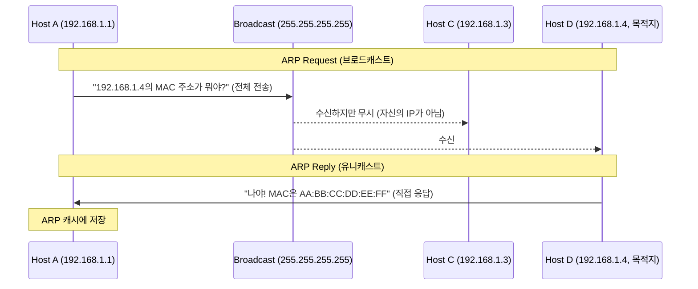

# ARP (Address Resolution Protocol)

2계층의 MAC 주소와 3계층의 IP 주소 간에는 아무 관계도 없는데, 통신은 IP 기반으로 일어나기 때문에 상대방의 MAC 주소를 알아내기 위해 사용되는 프로토콜.

## 동작 방식

## 핵심 특징

- **ARP Request**: 브로드캐스트(`FF:FF:FF:FF:FF:FF`)로 전송 → 같은 네트워크의 모든 호스트가 수신
- **ARP Reply**: 유니캐스트로 응답 → 요청한 호스트에게만 직접 전송
- **ARP 캐시**: 응답받은 IP-MAC 매핑을 일정 시간 캐싱해 반복 요청을 줄임
- **스코프**: 동일 서브넷(L2 네트워크) 내에서만 동작. 다른 서브넷은 기본 게이트웨이의 MAC을 조회함

