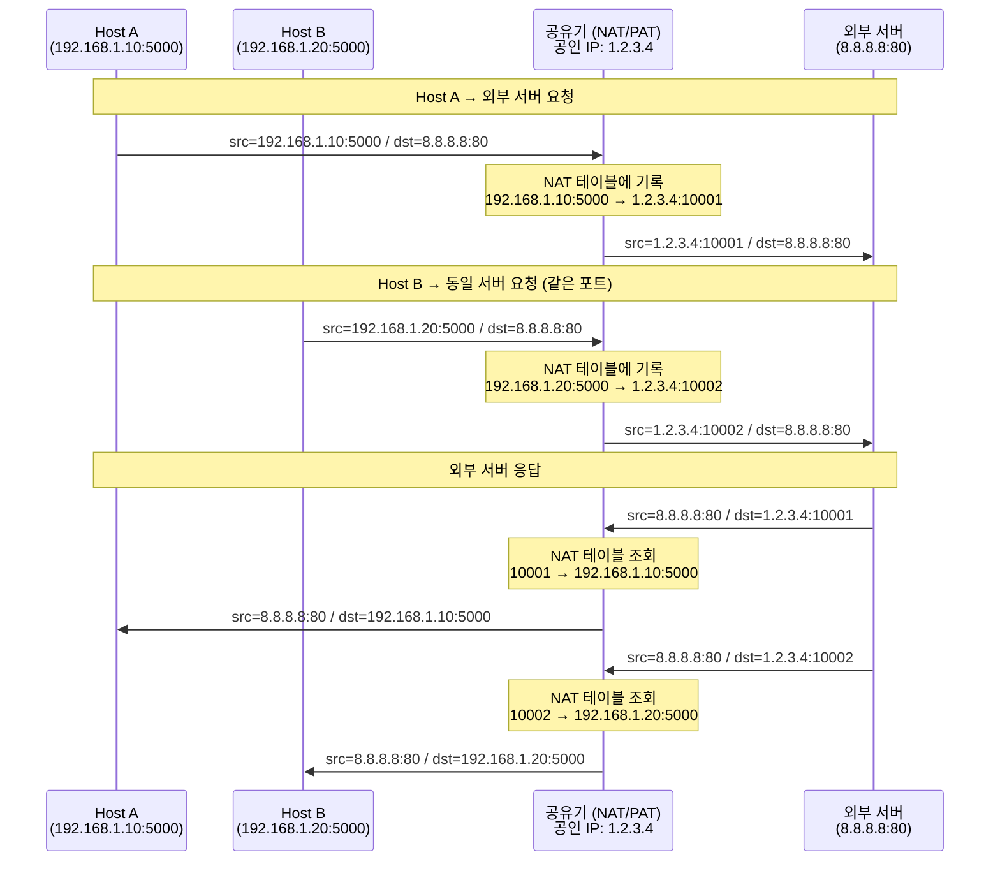

# NAT (Network Address Translation)

## 정의

IP 패킷의 출발지/목적지 IP 주소를 변환하는 기술. 주로 **사설 IP ↔ 공인 IP** 변환에 사용된다.

IPv4 주소 공간(약 43억 개)이 부족해지면서, 하나의 공인 IP로 내부 네트워크의 여러 호스트가 인터넷을 사용할 수 있도록 하는 것이 주된 목적이다. 부수적으로 내부 IP를 외부에서 직접 알 수 없게 되어 보안 효과도 있다.

## NAT vs PAT

| 구분 | NAT (순수) | PAT (= NAPT) |
|------|-----------|--------------|
| 정식 명칭 | Network Address Translation | Port Address Translation / NAPT |
| 변환 대상 | IP 주소만 변환 | IP 주소 + 포트 번호 변환 |
| 공인 IP 수 | 내부 호스트 수만큼 필요 (1:1) | 공인 IP 1개로 다수 호스트 지원 (N:1) |
| 주요 사용처 | 서버의 IP 은닉, 이전 구조 유지 | 가정/기업 인터넷 공유 (사실상 표준) |

> 실제로 가정용 공유기나 기업 방화벽에서 "NAT"라고 부르는 것은 거의 대부분 **PAT(NAPT)** 이다. "NAT"가 PAT를 포함하는 상위 개념으로 통용되고 있다.

## PAT 동작 방식



## 정적 NAT vs 동적 NAT

### 정적 NAT (Static NAT)

사설 IP와 공인 IP를 **1:1로 고정** 매핑. 관리자가 수동으로 설정하며 항상 동일한 공인 IP로 변환된다.

- 외부에서 내부 서버로의 **인바운드 연결**을 허용해야 할 때 사용 (웹 서버, 메일 서버 등)
- 공인 IP가 호스트 수만큼 필요하므로 비용이 높음
- 매핑이 고정되어 있어 예측 가능하고 관리가 단순함

```
192.168.1.10  ←→  1.2.3.10  (항상 고정)
192.168.1.20  ←→  1.2.3.20  (항상 고정)
```

### 동적 NAT (Dynamic NAT)

공인 IP 풀(pool)을 미리 정의해 두고, 내부 호스트가 요청할 때 **풀에서 유휴 공인 IP를 동적으로 할당**. 세션이 끝나면 반환된다.

- 공인 IP 풀보다 내부 호스트가 많으면 풀이 소진될 경우 연결 불가
- 외부에서 먼저 연결을 시도할 수 없음 (인바운드 불가)
- 정적 NAT보다 공인 IP를 효율적으로 사용하지만, PAT보다는 비효율적

```
192.168.1.10  →  1.2.3.10  (세션 중 임시 할당)
192.168.1.20  →  1.2.3.11  (세션 중 임시 할당)
192.168.1.30  →  대기 (풀 소진 시 연결 불가)
```

### 세 가지 비교

| 구분 | 정적 NAT | 동적 NAT | PAT (동적 NAT + 포트) |
|------|---------|---------|----------------------|
| 매핑 방식 | 1:1 고정 | 1:1 동적 | N:1 동적 |
| 공인 IP 수 | 호스트 수만큼 | 풀 크기만큼 | 1개로 충분 |
| 인바운드 연결 | 가능 | 불가 | 불가 |
| 주요 용도 | 공개 서버 운영 | 제한적 외부 접근 | 인터넷 공유 (일반적) |

## NAT 테이블

공유기는 내부적으로 다음과 같은 매핑 테이블을 유지한다.

| 내부 IP:Port | 공인 IP:Port | 외부 IP:Port |
|---|---|---|
| 192.168.1.10:5000 | 1.2.3.4:10001 | 8.8.8.8:80 |
| 192.168.1.20:5000 | 1.2.3.4:10002 | 8.8.8.8:80 |

포트 번호를 달리 부여함으로써 공인 IP 1개로 여러 내부 호스트의 세션을 구분한다.
