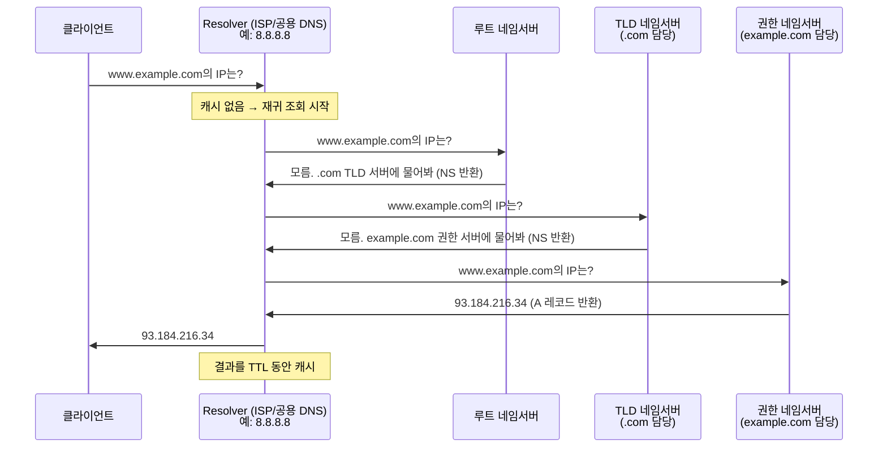
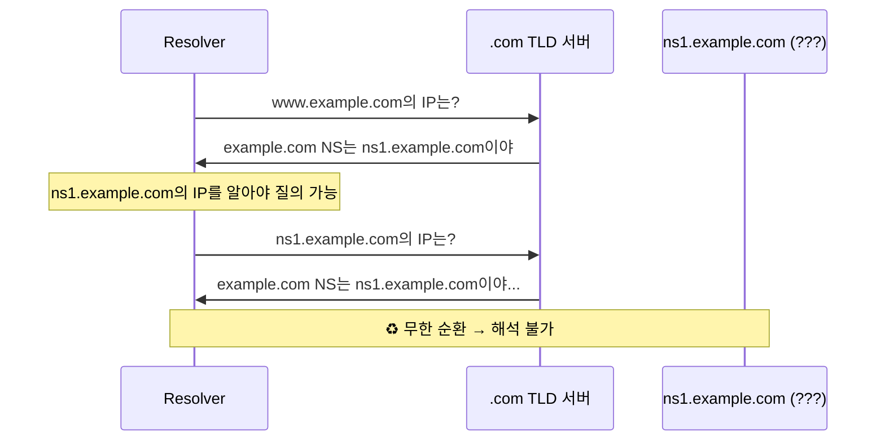
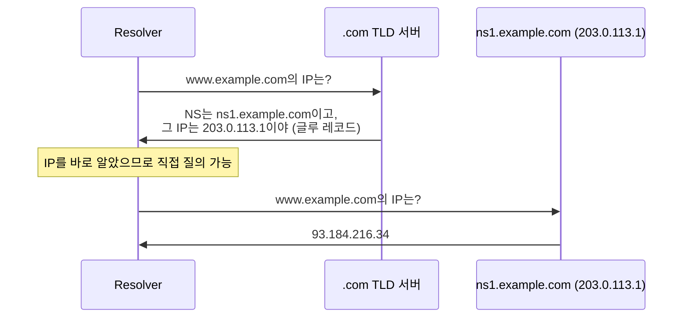
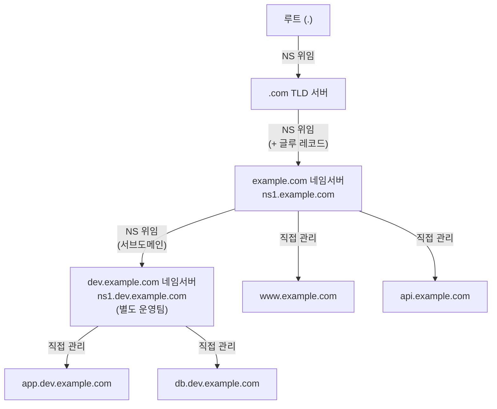
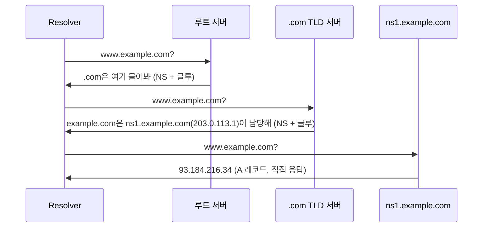

# 1. DNS 소개

DNS(Domain Name System)는 사람이 읽을 수 있는 도메인 이름(`www.example.com`)을 IP 주소(`93.184.216.34`)로 변환하는 분산 데이터베이스 시스템이다.

IP 주소는 기억하기 어렵기 때문에, DNS가 전화번호부처럼 이름과 주소를 매핑해준다. 전 세계에 계층적으로 분산된 수많은 서버가 협력해 동작하며, 단일 장애점이 없도록 설계되어 있다.

# 2. DNS 구조와 명명 규칙

도메인은 점(`.`)으로 구분된 계층 구조를 갖는다. 오른쪽에서 왼쪽으로 읽으며, 상위 계층이 하위 계층을 위임(delegation)한다.

```
www.example.com.
│   │       │  └─ 루트 도메인 (.)
│   │       └──── TLD (.com)
│   └──────────── 2차 도메인 (example)
└──────────────── 서브도메인 (www)
```

## 2.1. 루트 도메인

DNS 계층의 최상위. 표기상 생략되지만 모든 도메인의 끝에 `.`이 있다(`www.example.com.`).

- 전 세계 **13개의 루트 네임서버 그룹** (A~M)이 관리
- 실제로는 Anycast를 통해 수백 개의 물리 서버로 분산 운영됨
- TLD 서버의 위치 정보를 가지고 있음

## 2.2. Top-Level Domain (TLD)

루트 바로 아래 계층. 크게 세 종류로 나뉜다.

| 종류 | 예시 | 설명 |
|------|------|------|
| gTLD (일반) | `.com`, `.net`, `.org`, `.info` | 특정 국가에 귀속되지 않은 일반 도메인 |
| ccTLD (국가) | `.kr`, `.jp`, `.uk`, `.cn` | 국가/지역 코드 기반 |
| sTLD (스폰서) | `.edu`, `.gov`, `.mil` | 특정 기관만 등록 가능 |

# 3. DNS 동작 방식

클라이언트가 도메인을 조회할 때 다음 순서로 진행된다.



- **Resolver**: 클라이언트를 대신해 재귀적으로 질의하는 서버. 캐시를 보유함
- **재귀 질의(Recursive Query)**: 클라이언트 → Resolver. Resolver가 최종 답을 책임짐
- **반복 질의(Iterative Query)**: Resolver → 루트/TLD/권한 서버. 각 서버는 다음 서버 주소만 알려줌

# 4. DNS 서버 (Master, Slave)

권한 네임서버는 보통 이중화를 위해 Master-Slave 구조로 운영된다.

| 구분 | 역할 |
|------|------|
| **Master (Primary)** | 존(zone) 파일을 직접 편집하는 원본 서버. 변경사항 발생 시 Slave에게 통보 |
| **Slave (Secondary)** | Master로부터 존 파일을 복제(Zone Transfer)해 동기화. Master 장애 시 대신 응답 |

- **Zone Transfer**: Slave가 Master에게 존 데이터를 가져오는 과정. AXFR(전체), IXFR(증분) 방식이 있음
- **SOA 레코드**의 Serial 번호로 동기화 여부를 판단함 (Serial이 증가하면 Slave가 갱신)
- 외부에서 Zone Transfer를 악용해 내부 구조를 파악할 수 있으므로, 신뢰된 Slave IP만 허용해야 함

# 5. DNS 레코드

## 5.1. A (IPv4) 레코드

도메인 → IPv4 주소 매핑. 가장 기본적인 레코드.

```
www.example.com.  300  IN  A  93.184.216.34
```

하나의 도메인에 여러 A 레코드를 두어 라운드로빈 로드밸런싱에 활용하기도 한다.

## 5.2. AAAA (IPv6) 레코드

도메인 → IPv6 주소 매핑. A 레코드의 IPv6 버전.

```
www.example.com.  300  IN  AAAA  2606:2800:220:1:248:1893:25c8:1946
```

## 5.3. CNAME (Canonical Name) 레코드

도메인을 다른 도메인의 **별칭(alias)** 으로 지정. IP가 아닌 도메인을 가리킨다.

```
blog.example.com.  300  IN  CNAME  example.github.io.
```

- IP가 자주 바뀌는 서비스(CDN, 외부 호스팅 등)에 유용
- CNAME 대상은 최종적으로 A/AAAA 레코드로 귀결되어야 함
- 루트 도메인(`example.com`)에는 CNAME을 사용할 수 없음 (SOA, NS와 공존 불가)

## 5.4. SOA (Start Of Authority) 레코드

해당 존(zone)의 권한 정보와 관리 정보를 담은 레코드. 모든 존에 반드시 하나 존재한다.

```
example.com.  IN  SOA  ns1.example.com.  admin.example.com. (
    2026030101  ; Serial (버전 번호)
    3600        ; Refresh (Slave가 갱신 주기 확인하는 간격, 초)
    900         ; Retry (갱신 실패 시 재시도 간격, 초)
    604800      ; Expire (Master 연결 불가 시 Slave 데이터 유효 기간, 초)
    300         ; Minimum TTL (네거티브 캐시 TTL, 초)
)
```

## 5.5. NS (Name Server) 레코드

해당 도메인을 관리하는 **권한 네임서버**를 지정.

```
example.com.  IN  NS  ns1.example.com.
example.com.  IN  NS  ns2.example.com.
```

도메인 위임(delegation)의 핵심 레코드. 상위 TLD 서버가 NS 레코드를 통해 하위 도메인의 서버를 가리킨다.

## 5.6. MX (Mail eXchange) 레코드

해당 도메인으로 오는 이메일을 처리할 메일 서버를 지정. 우선순위(낮을수록 우선) 값을 가진다.

```
example.com.  IN  MX  10  mail1.example.com.
example.com.  IN  MX  20  mail2.example.com.
```

MX 레코드의 값은 반드시 A/AAAA 레코드를 가진 호스트명이어야 하며, CNAME은 사용할 수 없다.

## 5.7. PTR (Pointer) 레코드

IP 주소 → 도메인 이름 역방향 조회(Reverse DNS). `in-addr.arpa` 존에 위치한다.

```
34.216.184.93.in-addr.arpa.  IN  PTR  www.example.com.
```

IP를 뒤집어서 표기하는 것에 주의. 메일 서버의 스팸 필터링, 로그 분석 등에 활용된다.

## 5.8. TXT (TeXT) 레코드

도메인에 임의의 텍스트 정보를 붙이는 레코드. 주로 도메인 소유권 인증이나 이메일 보안에 사용된다.

| 용도 | 예시 |
|------|------|
| SPF | `v=spf1 include:_spf.google.com ~all` (발신 메일 서버 인가) |
| DKIM | 공개키를 TXT로 배포해 메일 서명 검증 |
| DMARC | SPF/DKIM 정책 및 리포팅 설정 |
| 도메인 소유권 | Google Search Console, AWS ACM 등 인증 토큰 |

# 6. DNS에서 알아두면 좋은 내용

## 6.1. 도메인 위임 (DNS Delegation)

DNS 위임은 상위 도메인이 하위 도메인의 관리 권한을 다른 네임서버에게 넘기는 것이다. DNS의 분산 구조를 가능하게 하는 핵심 메커니즘이다.

### 위임의 원리

상위 존(zone) 파일에 하위 도메인에 대한 **NS 레코드와 글루 레코드(Glue Record)** 를 등록하면, 그 하위 도메인의 모든 질의는 등록된 네임서버가 책임지게 된다.

```
; .com TLD 서버의 존 파일 (일부)
example.com.    IN  NS  ns1.example.com.
example.com.    IN  NS  ns2.example.com.

; 글루 레코드 (ns1/ns2가 example.com 안에 있으므로 필수)
ns1.example.com.  IN  A  203.0.113.1
ns2.example.com.  IN  A  203.0.113.2
```

### 글루 레코드(Glue Record)란?

위임된 네임서버 이름 자체가 위임 대상 도메인 내에 있을 경우 닭-달걀 문제가 발생한다.

> `example.com`의 NS가 `ns1.example.com`인데,
> `ns1.example.com`의 IP를 알려면 `example.com` 서버에 물어봐야 하는 상황

이를 해결하기 위해 **상위 서버(.com TLD)가 직접 ns1의 IP를 함께 제공**하는 것이 글루 레코드다. 글루 레코드는 상위 존에 위치하며, 도메인 등록 시 레지스트라(등록대행사)에 네임서버 IP를 등록하는 과정이 곧 글루 레코드 등록이다.

**글루 레코드가 없을 때 (순환 참조 문제)**



**글루 레코드가 있을 때 (정상 동작)**



### 서브도메인 위임

`example.com`의 운영자가 `dev.example.com`을 별도 팀의 네임서버로 위임하는 것도 가능하다.



### 위임 흐름 요약



각 단계에서 서버는 자신의 위임 범위(zone)만 책임지고, 나머지는 다음 서버로 넘긴다. 이것이 DNS가 전 세계적으로 분산되어 동작하는 핵심 원리다.

## 6.2. TTL (Time to Live)

DNS 응답이 캐시에 유지되는 시간(초 단위).

- **TTL이 길면**: 캐시 히트율이 높아 빠르고 DNS 서버 부하가 낮음. 단, 레코드 변경 시 전파가 느림
- **TTL이 짧으면**: 변경사항이 빠르게 반영됨. 단, DNS 트래픽이 증가하고 응답이 느려질 수 있음

> **IP 변경이나 서버 이전 전**에 TTL을 미리 짧게(예: 300초) 줄여두면, 실제 변경 시 전파 지연을 최소화할 수 있다.

## 6.3. 화이트 도메인

이메일 발신 도메인의 신뢰도를 높이기 위해 ISP나 이메일 서비스 제공업체에 등록하는 제도.

- 스팸 필터에서 정상 발신자로 인정받기 위한 용도
- 한국에서는 KISA(한국인터넷진흥원)가 운영하는 화이트 도메인 등록 시스템이 있음
- SPF, DKIM, DMARC 레코드 설정이 선행되어야 함

## 6.4. 한글 도메인

국제화 도메인(IDN, Internationalized Domain Name). 한글, 한자, 아랍어 등 비ASCII 문자로 된 도메인.

- 내부적으로는 **Punycode**로 변환되어 처리됨
  - 예: `한국.com` → `xn--3e0b707e.com`
- DNS 프로토콜 자체는 ASCII만 지원하므로, 브라우저/OS가 Punycode로 변환 후 질의함
- 피싱에 악용될 수 있음 (키릴 문자 등 유사 문자로 정상 도메인처럼 위장)
