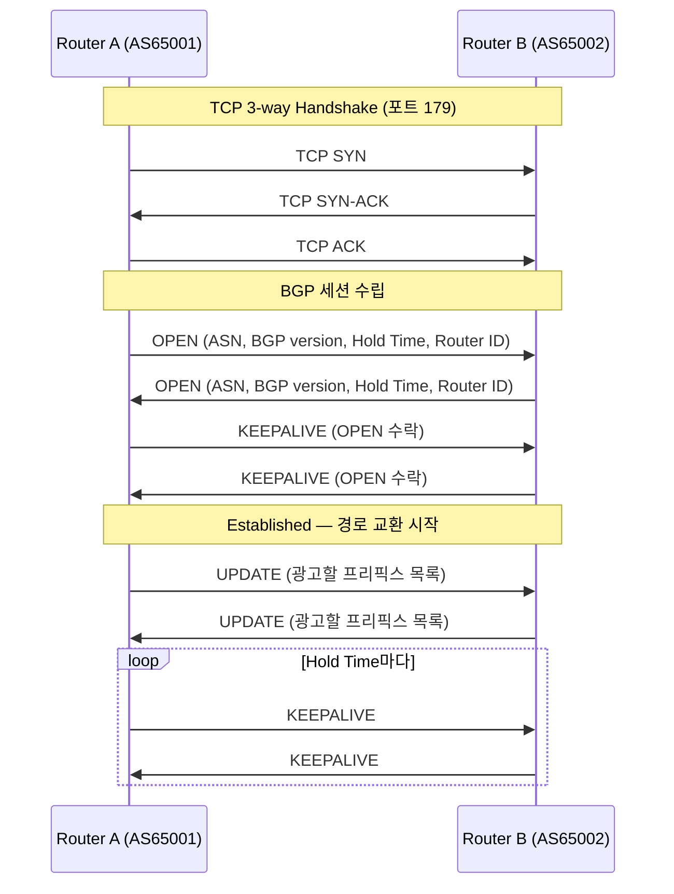
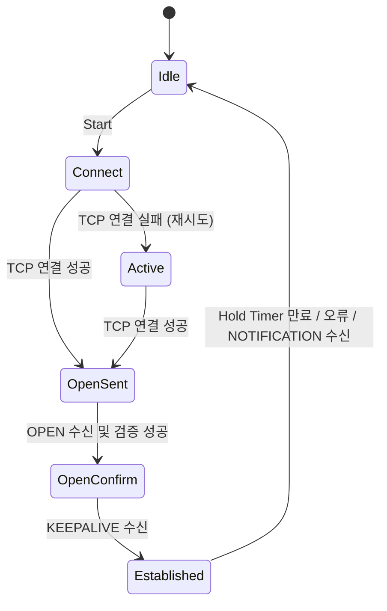
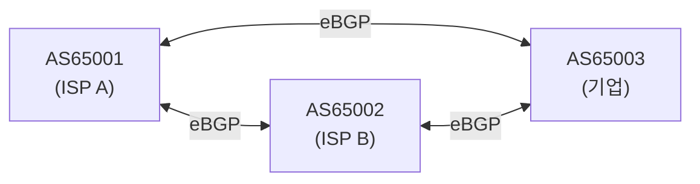

# BGP (Border Gateway Protocol)

## 정의

인터넷을 구성하는 **AS(Autonomous System, 자율 시스템) 간의 라우팅을 담당하는 프로토콜**. 현재 인터넷의 라우팅 기반이 되는 유일한 EGP(Exterior Gateway Protocol)이며, RFC 4271로 정의된 BGP-4가 현재 표준이다.

AS란 하나의 관리 주체(ISP, 기업, 대학 등)가 운영하는 IP 네트워크 집합으로, 각 AS는 고유한 **ASN(AS Number)** 을 부여받는다. 예를 들어 KT는 AS4766, SK브로드밴드는 AS9318, Google은 AS15169다.

## 목적

- **인터넷 규모의 라우팅**: OSPF 같은 IGP(Interior Gateway Protocol)는 AS 내부에서만 동작한다. AS 간 경로 교환에는 BGP가 필요하다.
- **정책 기반 라우팅**: 단순히 최단 경로가 아니라 비용, 계약 관계, 트래픽 엔지니어링 등 **비즈니스 정책**에 따라 경로를 선택할 수 있다.
- **경로 집약**: 수십만 개의 IP 프리픽스를 효율적으로 교환하고 집약한다. 현재 인터넷 라우팅 테이블에는 약 100만 개 이상의 프리픽스가 존재한다.

## iBGP vs eBGP

| 구분 | iBGP (Internal BGP) | eBGP (External BGP) |
|------|--------------------|--------------------|
| 동작 범위 | 동일 AS 내부 | 서로 다른 AS 간 |
| 주요 목적 | AS 내 BGP 경로 전파 | AS 간 경로 교환 |
| TTL | 기본 255 (멀리 있어도 됨) | 기본 1 (직접 연결된 피어만) |
| Next-hop | 변경하지 않음 (기본) | 자신의 IP로 변경 |
| Full-mesh 필요 | 원칙적으로 필요 (또는 Route Reflector) | 불필요 |

## 동작 방식

### 1. TCP 세션 수립

BGP는 **TCP 179번 포트** 위에서 동작한다. 라우팅 프로토콜이지만 신뢰성 있는 전송을 TCP에 위임한다.



### 2. BGP 상태 머신

BGP 피어링은 단계적으로 수립된다.



| 상태 | 설명 |
|------|------|
| **Idle** | BGP 비활성. 초기 상태 또는 오류 후 복귀 |
| **Connect** | TCP 연결 시도 중 |
| **Active** | TCP 연결 실패, 재시도 중 |
| **OpenSent** | TCP 연결 성공, OPEN 메시지 전송 후 대기 |
| **OpenConfirm** | OPEN 수신 완료, KEEPALIVE 대기 |
| **Established** | 피어링 완료, UPDATE 메시지 교환 가능 |

### 3. BGP 메시지 타입

| 타입 | 설명 |
|------|------|
| **OPEN** | 피어링 수립 시 교환. ASN, BGP 버전, Hold Time, Router ID 포함 |
| **UPDATE** | 경로 추가(광고) 또는 철회(Withdrawn). 경로 속성(Path Attributes) 포함 |
| **KEEPALIVE** | Hold Timer 갱신용. Hold Time/3 간격으로 전송 (기본 60초) |
| **NOTIFICATION** | 오류 발생 시 전송 후 세션 종료. 오류 코드와 서브코드 포함 |

### 4. 경로 선택 (Best Path Selection)

BGP는 동일한 목적지에 대해 여러 경로가 있을 경우 아래 순서로 최적 경로를 선택한다.

```
1. Weight (Cisco 독자 속성, 높을수록 우선)
2. Local Preference (AS 내부 선호도, 높을수록 우선)
3. Locally Originated (자신이 originate한 경로 우선)
4. AS Path Length (AS 홉 수, 짧을수록 우선)
5. Origin (IGP > EGP > Incomplete 순)
6. MED (Multi-Exit Discriminator, 낮을수록 우선)
7. eBGP > iBGP
8. IGP Metric (Next-hop까지의 내부 경로 비용, 낮을수록 우선)
9. Router ID (낮을수록 우선, 타이브레이커)
```

### 5. 경로 광고 및 전파



- AS65003이 `203.0.113.0/24`를 보유하고 있다면, eBGP로 AS65001과 AS65002에 광고한다.
- AS65001은 수신한 경로를 자신의 AS Path에 `65001`을 추가해 AS65002로 재광고한다.
- AS65002는 `203.0.113.0/24`로 가려면 AS Path가 `65001 65003` 또는 `65003` 중 더 짧은 쪽을 선택한다.

## BGP와 인터넷 안정성

- **BGP Hijacking**: 악의적인 AS가 타 AS의 IP 프리픽스를 자신의 것처럼 광고해 트래픽을 탈취하는 공격. 2008년 Pakistan Telecom이 YouTube를 차단하다가 전 세계 YouTube 트래픽을 블랙홀로 보낸 사고가 대표적 사례.
- **RPKI (Resource Public Key Infrastructure)**: BGP Hijacking 방지를 위해 IP 프리픽스와 ASN의 소유권을 암호학적으로 검증하는 체계. 점차 도입이 확산되고 있다.
- **BGP Blackhole**: DDoS 공격 트래픽을 업스트림 ISP에 알려 특정 IP로 향하는 트래픽을 라우팅 레벨에서 차단하는 기법. (`community 65535:666` 등)
