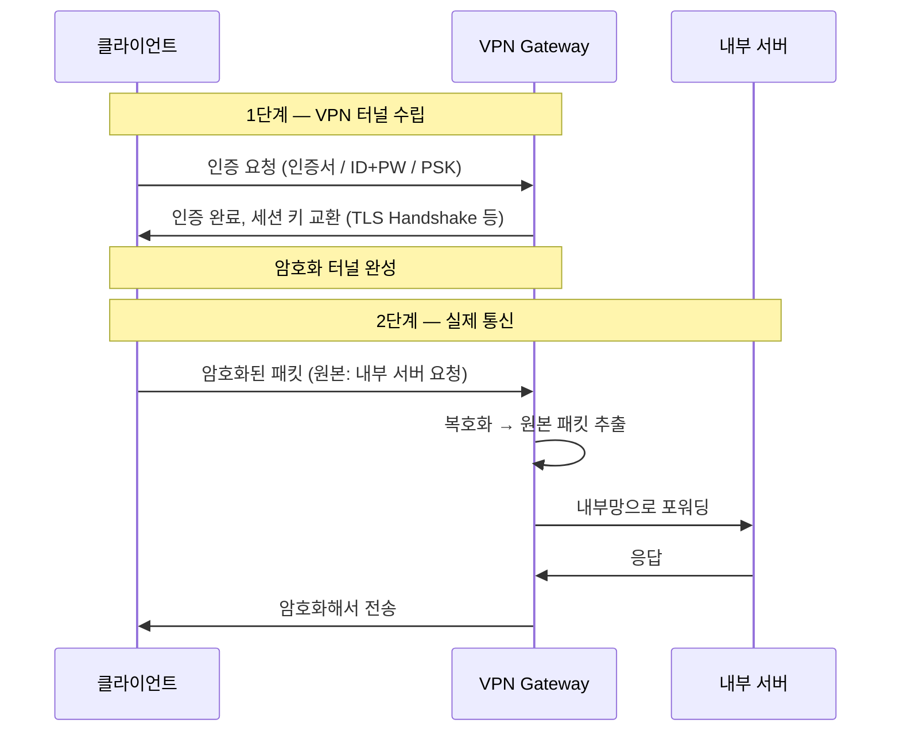
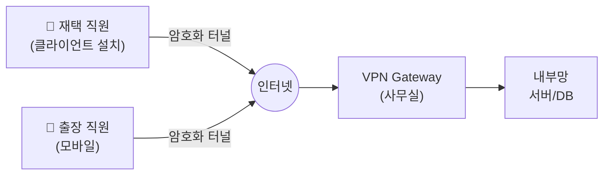
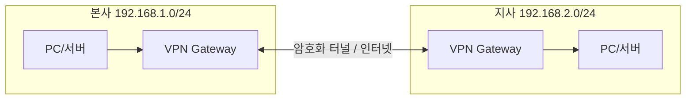
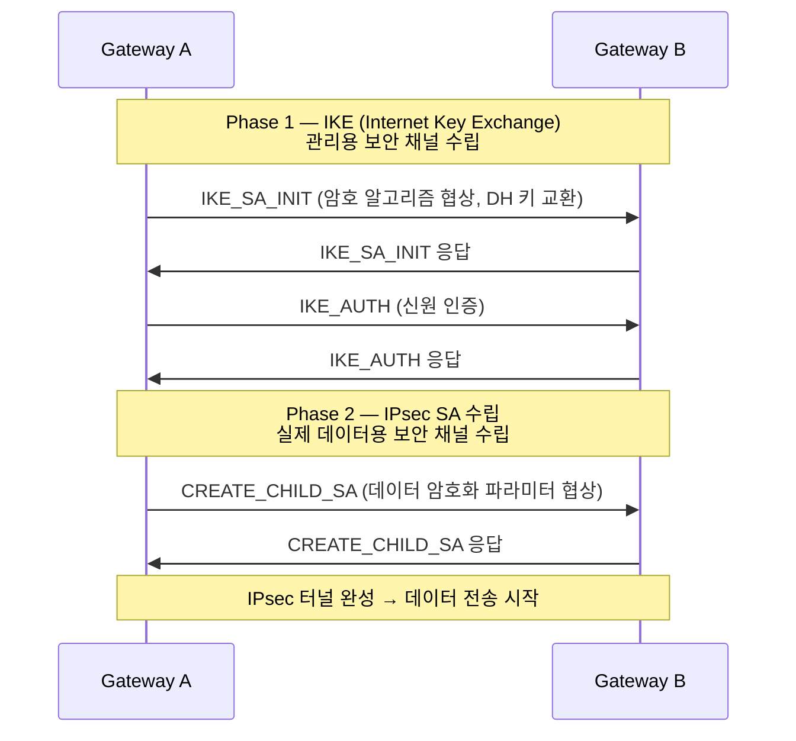
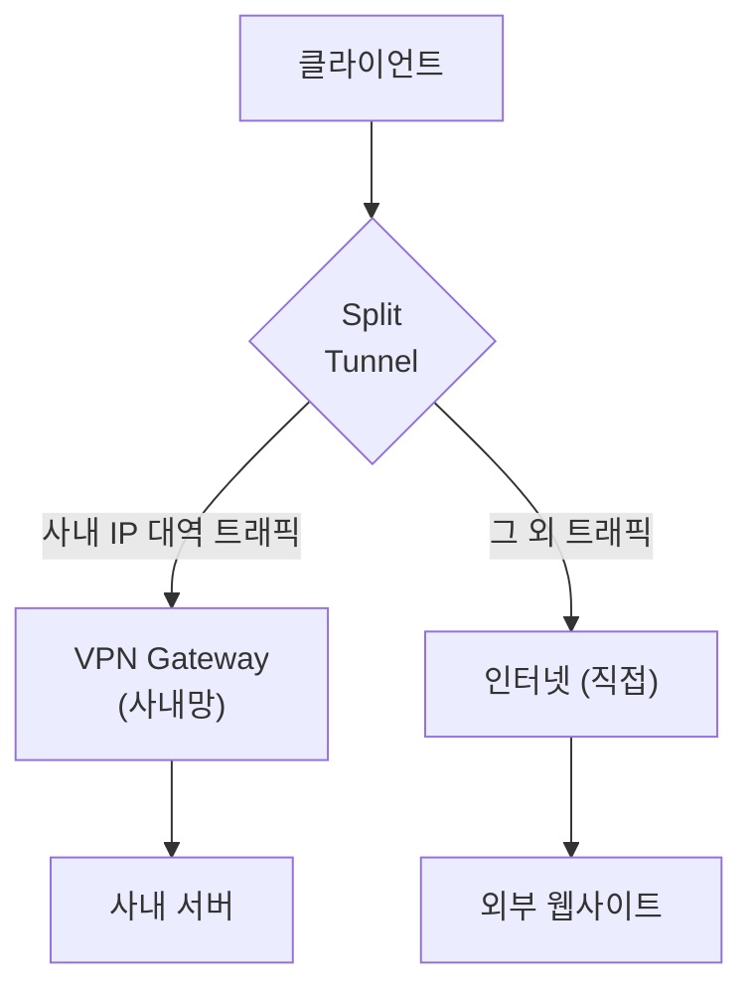

# 1. VPN 소개

VPN(Virtual Private Network)은 공용 네트워크(인터넷) 위에 **암호화된 가상 터널**을 만들어 마치 사설 네트워크에 직접 연결된 것처럼 통신하는 기술이다.

물리적으로 멀리 떨어진 두 지점을 전용선 없이 안전하게 연결하거나, 외부에서 사내 네트워크에 접근할 때 사용한다. 통신 내용이 암호화되므로 중간자가 패킷을 가로채도 내용을 알 수 없다.

# 2. VPN 동작 방식

## 2.1. 터널링 (Tunneling)

터널링은 원본 패킷을 새로운 패킷으로 **캡슐화(encapsulation)** 해 전송하는 기법이다. 내부 패킷은 외부에서 보이지 않으며, 목적지에서 역캡슐화해 원본을 복원한다.

```
[원본 패킷]
┌────────┬────────┬──────────┐
│ IP 헤더 │TCP 헤더│  데이터  │
└────────┴────────┴──────────┘

[터널링 후 패킷]
┌─────────────┬──────────────────────────────────────┐
│외부 IP 헤더  │ VPN 헤더 │ 암호화된 원본 패킷 전체    │
└─────────────┴──────────────────────────────────────┘
```

## 2.2. 암호화 및 인증

단순 터널링만으로는 도청을 막을 수 없다. VPN은 여기에 **암호화와 인증**을 더한다.

| 기능 | 목적 |
|------|------|
| **암호화** | 제3자가 패킷 내용을 볼 수 없도록 함 (기밀성) |
| **무결성 검증** | 전송 중 패킷이 변조되지 않았음을 확인 (HMAC 등) |
| **인증** | 연결 상대방이 신뢰된 주체임을 확인 (인증서, PSK, ID/PW) |

## 2.3. 기본 동작 흐름



# 3. VPN 종류

## 3.1. Remote Access VPN

개별 사용자가 원격에서 사내 네트워크에 접속하는 방식. 재택근무, 외부 출장 시 가장 많이 사용하는 유형이다.



- 클라이언트 PC에 VPN 소프트웨어(에이전트)를 설치
- 연결 시 사내 IP 대역의 주소를 할당받아 내부 서버에 직접 접근 가능

## 3.2. Site-to-Site VPN

두 개 이상의 **거점 네트워크를 상시 연결**하는 방식. 본사-지사, 데이터센터 간 연결에 사용한다. 각 거점의 라우터/방화벽이 VPN Gateway 역할을 하므로 클라이언트 측 에이전트 설치가 불필요하다.



## 3.3. 비교

| 구분 | Remote Access VPN | Site-to-Site VPN |
|------|-------------------|------------------|
| 대상 | 개인 사용자 | 거점 네트워크 |
| 클라이언트 설치 | 필요 | 불필요 |
| 터널 수명 | 사용 시에만 | 상시 유지 |
| 인증 | 사용자 인증 (ID/PW, 인증서, OTP) | 게이트웨이 간 인증 (PSK, 인증서) |
| 대표 용도 | 재택근무, 원격 접속 | 본사-지사 연결, 클라우드 연결 |

# 4. 주요 VPN 프로토콜

## 4.1. IPsec (IP Security)

네트워크 계층(L3)에서 동작하는 표준 VPN 프로토콜 묶음. Site-to-Site VPN의 사실상 표준이다.

두 가지 모드가 있다.

| 모드 | 설명 | 사용 사례 |
|------|------|-----------|
| **Transport Mode** | 원본 IP 헤더는 유지하고 페이로드만 암호화 | 호스트 간 직접 통신 |
| **Tunnel Mode** | 원본 패킷 전체를 새 IP 패킷으로 캡슐화 | VPN Gateway 간 (일반적) |

IPsec은 두 단계로 터널을 수립한다.



- **AH (Authentication Header)**: 인증/무결성만 제공. 암호화 없음
- **ESP (Encapsulating Security Payload)**: 암호화 + 인증/무결성 제공. 실무에서는 ESP만 사용하는 경우가 대부분

## 4.2. OpenVPN

오픈소스 VPN 솔루션. **TLS(SSL) 위에서 동작**하며 TCP 443이나 UDP 1194를 사용할 수 있어 방화벽을 잘 통과한다.

- 소프트웨어 기반으로 거의 모든 OS에서 동작
- 인증서 기반 또는 PSK 기반 인증
- IPsec에 비해 설정이 단순하고 커스터마이징이 쉬움
- 성능은 커널 레벨 구현인 IPsec에 비해 다소 낮음

## 4.3. WireGuard

최신 VPN 프로토콜 (2015년 공개). **리눅스 커널에 내장**(5.6 이상)되어 고성능을 발휘한다.

- 코드베이스가 약 4,000줄로 IPsec/OpenVPN 대비 압도적으로 단순 → 감사(audit)와 보안 검증이 쉬움
- 고정된 최신 암호화 알고리즘만 사용 (ChaCha20, Poly1305, Curve25519 등)
- 핸드셰이크가 빠르고 모바일 로밍(IP 변경)에 강함
- 설정이 단순 (공개키 기반)

## 4.4. SSL/TLS VPN (Clientless)

웹 브라우저만으로 접속 가능한 VPN. 별도 클라이언트 없이 HTTPS 포털에 접속해 내부 자원을 사용한다.

- 주로 웹 애플리케이션, 파일 공유에 적합
- 전체 네트워크 접근보다 특정 서비스만 노출하는 제로 트러스트 개념에 가까움
- 대표 제품: Cisco AnyConnect, Palo Alto GlobalProtect, F5 APM

## 4.5. 프로토콜 비교

| 프로토콜 | 계층 | 성능 | 보안 | 설정 복잡도 | 주 용도 |
|----------|------|------|------|------------|---------|
| IPsec | L3 | 높음 | 높음 | 복잡 | Site-to-Site, Enterprise |
| OpenVPN | L4(TLS) | 중간 | 높음 | 중간 | Remote Access |
| WireGuard | L3 (커널) | 매우 높음 | 높음 | 낮음 | 범용 |
| SSL VPN | L7(HTTPS) | 낮음 | 중간 | 낮음 | 웹 기반 원격 접속 |

# 5. VPN에서 알아두면 좋은 내용

## 5.1. Split Tunneling

VPN이 연결된 상태에서 **트래픽 일부만 VPN 터널로 보내고** 나머지는 로컬 인터넷으로 직접 내보내는 방식.



- **장점**: VPN Gateway 부하 감소, 외부 인터넷 속도 향상
- **단점**: 클라이언트가 인터넷에 직접 노출되어 보안 정책 우회 가능성이 있음. 기업 보안 정책에 따라 비활성화하기도 함

## 5.2. DNS Leak

VPN 사용 중에도 DNS 쿼리가 VPN 터널 밖(ISP DNS 서버)으로 새어나가는 현상. 사용자의 실제 위치나 접속 목적지가 노출될 수 있다.

- **원인**: OS의 DNS 설정이 VPN 연결 시 자동 변경되지 않거나, Split Tunneling에서 DNS 트래픽이 제외될 때
- **확인**: `dnsleaktest.com` 등으로 점검
- **방지**: VPN 연결 시 DNS를 VPN 내부 서버로 강제 설정, 또는 DNS over TLS/HTTPS(DoT/DoH) 사용

## 5.3. Kill Switch

VPN 연결이 끊어졌을 때 **인터넷 전체를 차단**해 트래픽이 VPN 없이 나가지 못하도록 하는 기능.

- 연결 끊김이 일시적이더라도 실제 IP가 노출되는 것을 막음
- 주로 프라이버시가 중요한 환경에서 활성화. 기업 환경에서도 정책 위반 방지 용도로 사용

## 5.4. VPN과 제로 트러스트(Zero Trust)

전통적인 VPN은 **내부망 진입 후 모든 자원에 접근 가능**한 구조다. 한 번 뚫리면 내부 전체가 위험에 노출된다.

**제로 트러스트**는 "내부망도 신뢰하지 않는다"는 원칙으로, 매 요청마다 사용자·기기·상황을 검증해 최소 권한만 부여한다. VPN 없이도 안전한 접근을 구현할 수 있으며, VPN과 함께 쓰이기도 한다.

> VPN과 제로 트러스트는 대체 관계가 아니라 보완 관계로 보는 것이 일반적이다. 완전한 제로 트러스트 전환 전까지 VPN은 과도기적 수단으로 많이 활용된다.
