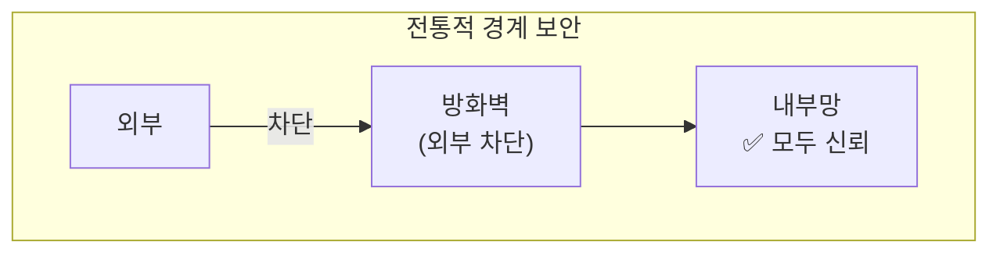
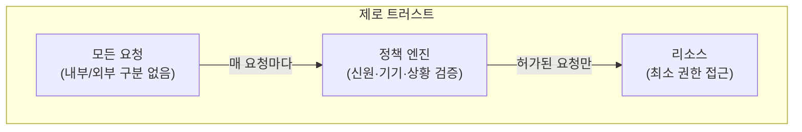
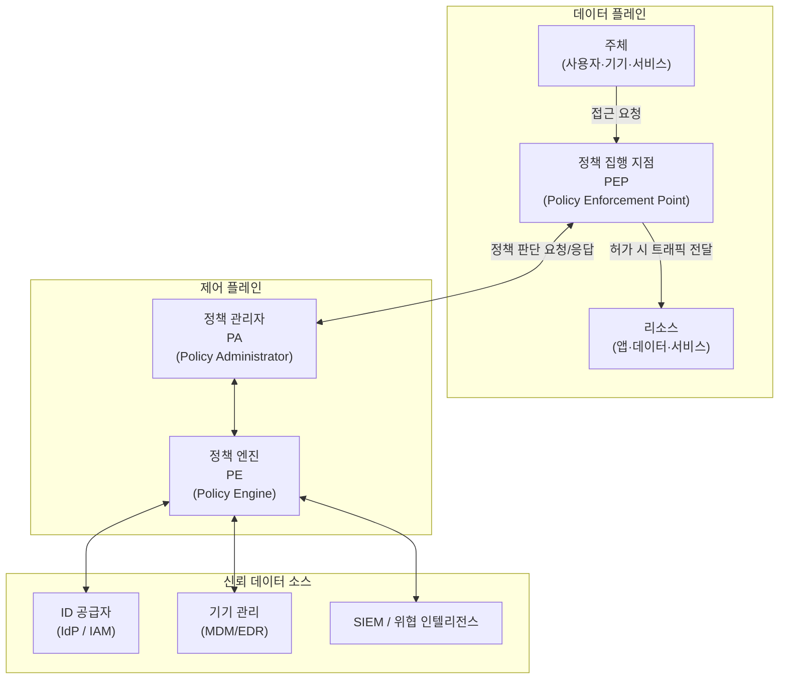
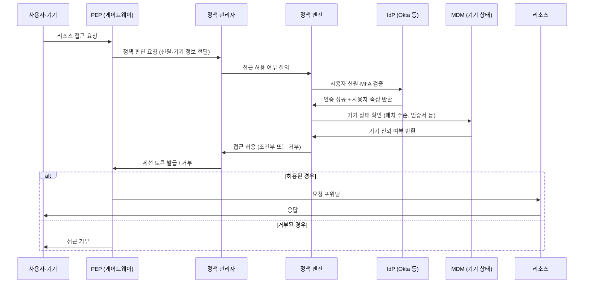

# 1. 제로 트러스트란

**제로 트러스트(Zero Trust)** 는 "아무것도 신뢰하지 않는다(Never Trust, Always Verify)"는 원칙에 기반한 보안 모델이다. 2010년 Forrester Research의 John Kindervag가 제안했으며, Google의 BeyondCorp 구현으로 널리 알려졌다.

전통적인 보안 모델은 내부망을 신뢰하고 외부를 차단하는 **경계 기반(Perimeter-based)** 구조였다. 방화벽과 VPN으로 내부망에 진입하면 이후에는 별다른 검증 없이 자원에 접근할 수 있었다.

제로 트러스트는 이 전제를 뒤집는다. 내부망이든 외부망이든 모든 요청을 동등하게 의심하고, **매 요청마다 신원·기기·상황을 검증**한 뒤 최소한의 권한만 부여한다.

# 2. 전통적 경계 보안 vs 제로 트러스트

| 구분    | 전통적 경계 보안                  | 제로 트러스트              |
| ----- | -------------------------- | -------------------- |
| 신뢰 기준 | 네트워크 위치 (내부 = 신뢰)          | 신원 + 기기 + 상황         |
| 검증 시점 | 진입 시 1회                    | 매 요청마다               |
| 내부 이동 | 자유로움 (Lateral Movement 위험) | 최소 권한, 각 자원마다 인가 필요  |
| 원격 접근 | VPN으로 내부망 편입               | 직접 검증 후 접근           |
| 위협 가정 | 외부만 위협                     | 내부도 이미 침해됐을 수 있다고 가정 |

# 3. 제로 트러스트의 핵심 원칙

## 3.1. 명시적 검증 (Verify Explicitly)

항상 사용 가능한 모든 데이터를 사용해 인증하고 인가한다.

- **신원**: 사용자 계정, MFA
- **기기**: 기기 등록 여부, 보안 패치 수준, 인증서
- **위치**: 접속 IP, 국가, 알려진 네트워크 여부
- **서비스/앱**: 접근하려는 자원과 권한
- **이상 탐지**: 비정상적인 행동 패턴 (시간, 접근 패턴 등)

## 3.2. 최소 권한 접근 (Least Privilege Access)

업무에 필요한 최소한의 권한만 부여하고, 권한을 시간 및 범위로 제한한다.

- JIT(Just-In-Time) 접근: 필요한 순간에만 권한 부여
- JEA(Just-Enough-Access): 해당 작업에 필요한 범위만 허용
- 사용자가 내부망 전체에 접근하는 것이 아니라 **특정 앱/서비스에만 접근**

## 3.3. 침해 가정 (Assume Breach)

내부망이 이미 침해됐다고 가정하고 설계한다.

- 네트워크를 마이크로세그먼트로 분리 → 침해 시 측면 이동(Lateral Movement) 차단
- 모든 접근 로그 수집 및 분석
- 암호화: 내부 통신도 암호화

# 4. 제로 트러스트 아키텍처

NIST SP 800-207 표준에서 정의한 논리적 구성 요소다.

| 구성요소 | 역할 |
|----------|------|
| **PEP** (Policy Enforcement Point) | 실제 트래픽을 허용/차단하는 게이트. 프록시, API 게이트웨이, 방화벽 등이 해당 |
| **PE** (Policy Engine) | 접근 허용 여부를 결정하는 두뇌. 신원·기기·정책을 종합해 판단 |
| **PA** (Policy Administrator) | PE의 결정을 PEP에 전달하고 세션 토큰/자격증명을 발급 |
| **IdP** | 사용자 신원 확인 (Okta, Azure AD, Google Workspace 등) |
| **MDM/EDR** | 기기의 보안 상태 확인 |
| **SIEM** | 로그 수집·분석, 이상 탐지 |

# 5. 제로 트러스트 접근 흐름

# 6. 구현 방식

## 6.1. SDP (Software Defined Perimeter)

리소스의 존재 자체를 인가된 사용자에게만 공개하는 방식. 인증 전에는 서버 IP조차 알 수 없다.

- **SPA(Single Packet Authorization)**: 첫 번째 패킷으로 신원을 증명한 후에만 포트가 열림
- 대표 제품: Cloudflare Access, Zscaler Private Access, Palo Alto Prisma Access

## 6.2. IAP (Identity-Aware Proxy)

프록시가 모든 요청을 가로채 신원 기반으로 인가를 결정한다. Google의 BeyondCorp가 이 방식이다.

- VPN 없이 인터넷에서 직접 사내 앱에 접근
- 앱 단위로 접근 제어 → 내부망 전체가 아닌 특정 앱만 노출

## 6.3. ZTNA (Zero Trust Network Access)

Remote Access VPN을 대체하는 서비스 형태의 제로 트러스트 접근 제어. 사용자는 클라이언트 에이전트를 통해 접속하며, 전체 네트워크가 아닌 인가된 앱에만 접근 가능하다.

| 구분 | 전통 VPN | ZTNA |
|------|----------|------|
| 접근 단위 | 내부망 전체 | 개별 앱/서비스 |
| 리소스 노출 | 내부망 IP 대역 전체 | 허가된 앱만 |
| 인증 | 연결 시 1회 | 지속적 검증 |
| 기기 상태 확인 | 제한적 | 필수 |

# 7. 알아두면 좋은 내용

## 7.1. VPN과의 관계

제로 트러스트는 VPN의 **대체재가 아닌 보완재**로 보는 것이 일반적이다. 완전한 제로 트러스트 전환까지는 시간과 비용이 상당히 들기 때문에, 현실에서는 VPN을 유지하면서 단계적으로 제로 트러스트를 도입하는 경우가 많다.

> VPN은 "내부망 진입 후 자유 이동"을 허용하지만, ZTNA는 "인가된 앱에만 접근"으로 공격 표면을 최소화한다.

## 7.2. 마이크로세그멘테이션 (Micro-segmentation)

내부 네트워크를 작은 단위로 나눠 서로 간의 통신도 정책으로 제어하는 기법. 침해가 발생해도 공격자가 내부에서 횡으로 이동(Lateral Movement)하지 못하도록 막는다.

- 전통적 방화벽은 외부 경계만 보호 → 내부 침해 시 속수무책
- 마이크로세그멘테이션은 각 워크로드·앱 단위로 방화벽을 적용
- SDN, eBPF, 클라우드 보안 그룹(AWS Security Group 등)으로 구현

## 7.3. 주요 구현 사례

| 기업/서비스 | 구현 방식 | 특징 |
|------------|-----------|------|
| Google BeyondCorp | IAP | VPN 없이 구글 직원의 내부 앱 접근. 제로 트러스트 개념을 대중화 |
| Cloudflare Access | ZTNA / SDP | 글로벌 엣지에서 접근 제어. 별도 하드웨어 불필요 |
| Zscaler ZPA | ZTNA | 클라우드 기반 제로 트러스트 접근. 앱만 노출 |
| Microsoft Entra | IAP + 조건부 접근 | Azure AD 연동. 기기 상태·위치·리스크 스코어 기반 정책 |
