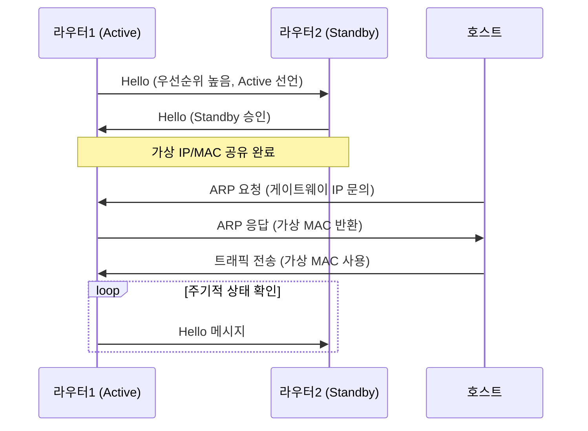
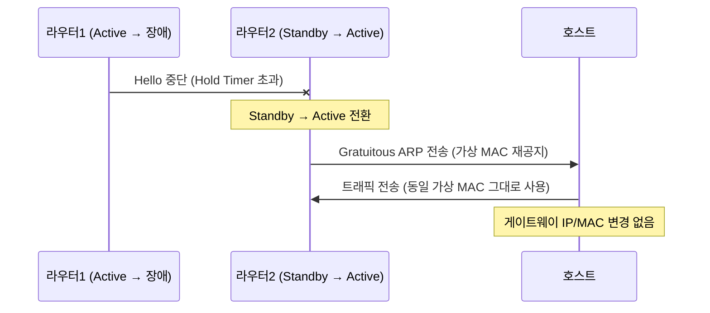
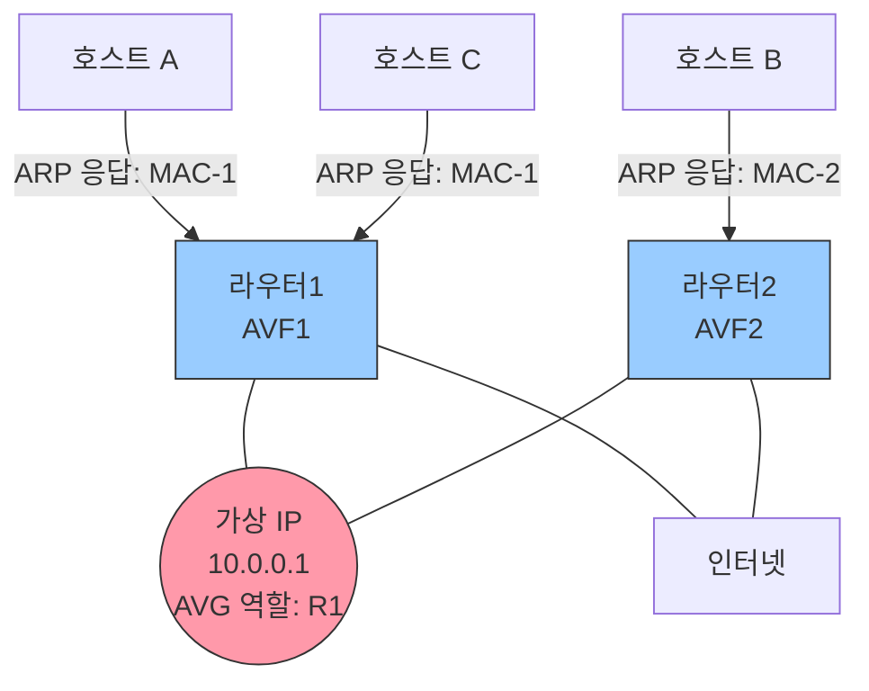
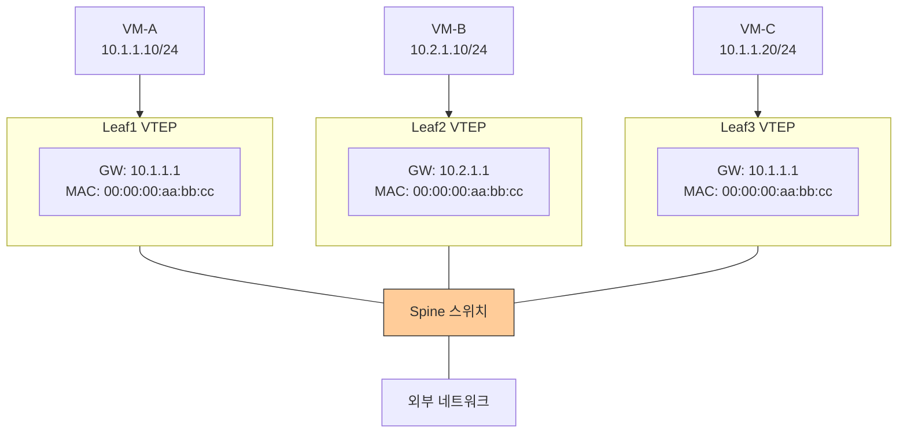
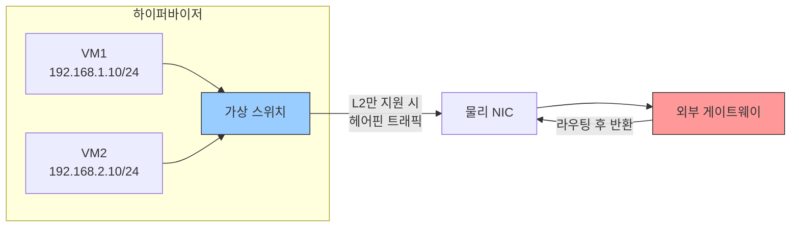
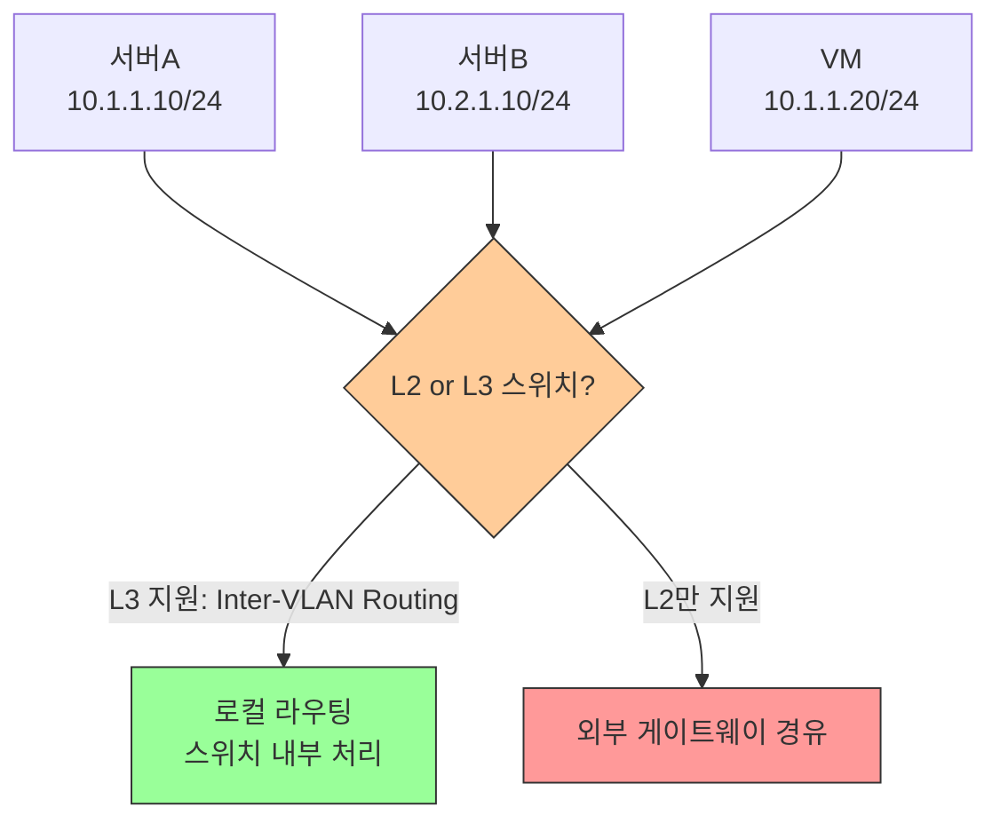

# 게이트웨이 이중화란?

내부 네트워크에서 외부(인터넷)로 나가는 첫 번째 홉인 **기본 게이트웨이**가 단일 장비일 경우, 해당 장비 장애 시 외부 통신이 전면 단절되는 **SPOF(Single Point of Failure)** 문제가 발생함.

게이트웨이 이중화는 두 대 이상의 라우터/L3 스위치를 게이트웨이로 구성해 고가용성(HA, High Availability)을 확보하는 기술.

이중화 방식은 크게 세 가지로 구분됨:

| 방식 | 설명 | 대표 프로토콜/기술 |
|---|---|---|
| **Active/Standby** | 한 대만 활성화, 나머지는 대기 | HSRP, VRRP |
| **올 액티브** | 모두 활성화하여 트래픽 분산 | GLBP, ECMP |
| **애니캐스트** | 분산된 게이트웨이가 각자 로컬 처리 | EVPN Anycast GW |

# FHRP

**FHRP(First Hop Redundancy Protocol)**는 호스트의 기본 게이트웨이 설정을 변경하지 않고, 여러 라우터가 하나의 **가상 IP(VIP)**와 **가상 MAC**을 공유하여 게이트웨이 이중화를 제공하는 프로토콜군.

주요 FHRP 프로토콜 비교:

| 프로토콜 | 개발사 | 표준 | 역할 명칭 | 부하 분산 |
|---|---|---|---|---|
| **HSRP** (Hot Standby Router Protocol) | Cisco | 독점 | Active / Standby | 미지원 |
| **VRRP** (Virtual Router Redundancy Protocol) | - | RFC 5798 | Master / Backup | 미지원 |
| **GLBP** (Gateway Load Balancing Protocol) | Cisco | 독점 | AVG / AVF | 지원 |

## FHRP의 동작 방식

FHRP는 가상 IP와 가상 MAC을 이용해 게이트웨이를 추상화함. 호스트 입장에서는 게이트웨이가 단일 장비처럼 보임.

**선출 과정 및 정상 동작**

**페일오버 동작**

> **Gratuitous ARP**: ARP 요청 없이 자신의 MAC을 브로드캐스트하여 네트워크의 ARP 캐시를 갱신하는 ARP. 페일오버 시 호스트가 빠르게 새 Active를 인식하도록 함.

# 올 액티브 게이트웨이 이중화

Active/Standby 방식은 Standby 장비가 평소에 유휴 상태로 낭비됨. **올 액티브 이중화**는 모든 게이트웨이 장비가 동시에 트래픽을 처리하여 **대역폭 활용도**와 **부하 분산** 효과를 얻는 방식.

**대표 기술:**
- **GLBP**: 단일 가상 IP에 여러 가상 MAC을 매핑. AVG(Active Virtual Gateway)가 ARP 응답 시 각 AVF(Active Virtual Forwarder)의 MAC을 라운드로빈으로 반환
- **ECMP(Equal-Cost Multi-Path)**: 라우팅 테이블에 동일 목적지에 대한 여러 경로를 등록하여 트래픽 분산

> AVG가 장애 발생 시 AVF 중 하나가 AVG 역할을 자동으로 승계함.

# 애니캐스트 게이트웨이

**애니캐스트 게이트웨이(Anycast Gateway)**는 EVPN/VXLAN 환경에서 주로 사용하는 분산 게이트웨이 방식. 모든 Leaf 스위치(VTEP)에 **동일한 가상 IP와 가상 MAC**을 설정하여, 각 스위치가 자신에게 연결된 호스트에 대해 로컬에서 직접 게이트웨이 역할을 수행함.

**기존 FHRP와의 차이:**

| 항목 | FHRP | 애니캐스트 게이트웨이 |
|---|---|---|
| 게이트웨이 위치 | 특정 라우터(Active) | 모든 Leaf 스위치 분산 |
| 트래픽 경로 | Active 라우터 경유 | 로컬 스위치에서 직접 처리 |
| VM 이동(Migration) | ARP 갱신 필요 | IP/MAC 불변으로 갱신 불필요 |
| 확장성 | 제한적 | 높음 (Leaf 추가만으로 확장) |
| 주 사용 환경 | 전통적 네트워크 | EVPN/VXLAN 데이터센터 |

> VM-A와 VM-C는 같은 서브넷(10.1.1.0/24)이지만 서로 다른 Leaf에 연결됨. EVPN이 VXLAN 터널을 통해 직접 통신 경로를 제공함.

# 게이트웨이 고려사항

## 가상화 서버 내의 서로 다른 네트워크를 가진 가상 서버 간 통신

하이퍼바이저(ESXi, KVM 등) 위에서 서로 다른 서브넷의 VM 간 통신 시, 가상 스위치의 L3 지원 여부에 따라 트래픽 경로가 달라짐.

- 가상 스위치가 L3 기능 미지원 시, 동일 하이퍼바이저 내 VM 간 통신도 **물리 게이트웨이를 왕복(헤어핀 트래픽)**해야 함
- **NSX, OVS** 등 SDN 솔루션 활용 시 하이퍼바이저 내부에서 라우팅 처리 → 물리 네트워크 부하 및 지연 감소

## 동일한 스위치에 연결된 서로 다른 네트워크를 가진 서버 간 통신(가상화 포함)

같은 L2 스위치에 연결된 서버도 서브넷이 다르면 **L3 라우팅이 반드시 필요**함.

- **L3 스위치**: VLAN 간 라우팅(Inter-VLAN Routing)을 스위치 내부에서 처리 → 게이트웨이 트래픽 최소화
- **L2 스위치**: 서브넷 간 통신 시 반드시 외부 라우터/게이트웨이 경유 → 게이트웨이가 SPOF 및 병목이 될 수 있음
- 가상화 환경에서는 VM의 서브넷이 다양하므로, 스위치의 L3 기능 지원 여부가 트래픽 효율에 큰 영향을 줌
