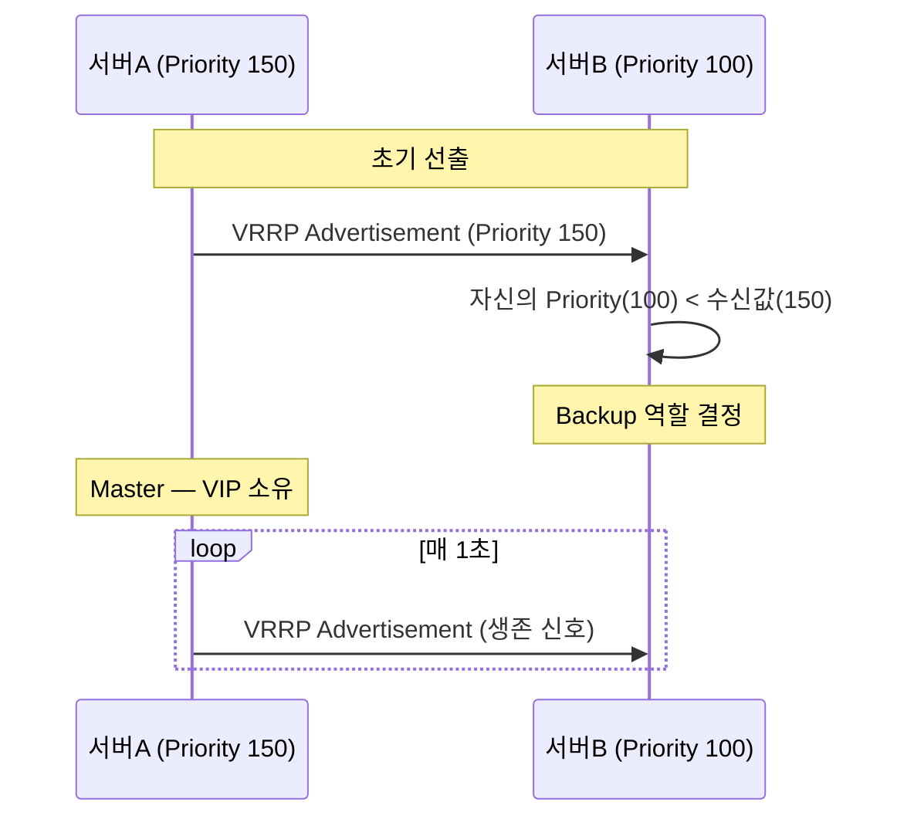
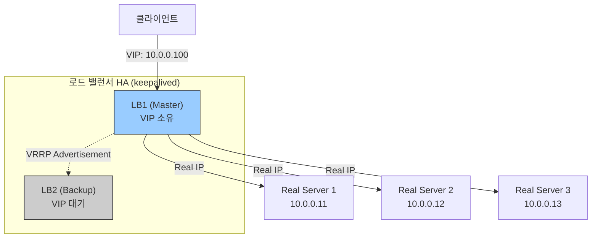
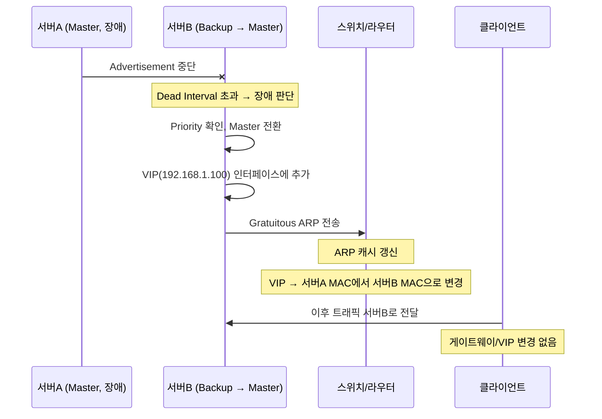
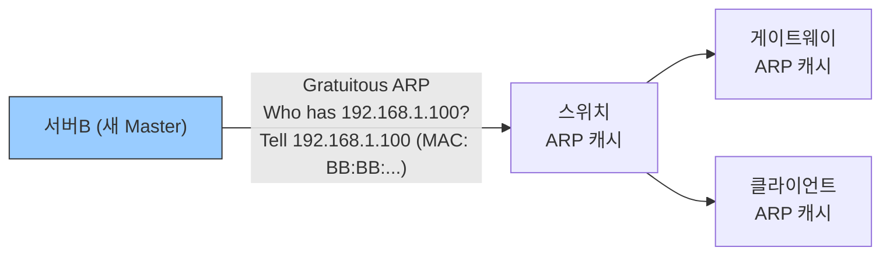

# 1. 가상 IP (VIP) 란?

**VIP(Virtual IP)**는 특정 물리 장비에 종속되지 않고, 여러 장비가 공유하는 논리적 IP 주소.

물리 장비의 실제 IP(Real IP)와 달리, VIP는 장비 장애 시 다른 장비로 이전(Failover)될 수 있음. 클라이언트는 VIP만 알면 되므로 내부 구성이 바뀌어도 연결이 유지됨.

**핵심 원리**: ARP를 통해 VIP ↔ 현재 소유 장비의 MAC 주소가 매핑됨. 소유 장비가 바뀌면 Gratuitous ARP로 네트워크의 ARP 캐시를 갱신함.

## 1.1. VIP 사용 사례

| 사용 사례 | 설명 | 대표 기술 |
|---|---|---|
| **게이트웨이 이중화** | 기본 게이트웨이 HA 구성 | HSRP, VRRP, GLBP |
| **서버 클러스터 HA** | Active/Standby 서버 이중화 | keepalived + VRRP |
| **로드 밸런서 진입점** | 다수 서버로 트래픽 분산 | HAProxy, LVS/IPVS |
| **클라우드 이동 IP** | 인스턴스 교체 없이 IP 유지 | AWS Elastic IP, OpenStack Floating IP |
| **DB 클러스터** | Primary 장애 시 Standby로 자동 전환 | Galera, Patroni |

> 게이트웨이 이중화(HSRP/VRRP/GLBP)의 상세 동작은 [[202603021902 게이트웨이 이중화와 FHRP]] 참조.

# 2. VIP 구성 프로토콜

## 2.1. VRRP (Virtual Router Redundancy Protocol)

RFC 5798로 정의된 표준 프로토콜. 여러 장비 중 **Master** 한 대가 VIP를 소유하고, 나머지는 **Backup**으로 대기.

| 구성 요소 | 설명 |
|---|---|
| **VRID** (Virtual Router ID) | 같은 VIP 그룹을 식별하는 ID (1~255) |
| **Priority** | Master 선출 우선순위. 높을수록 우선 (1~254, 기본 100) |
| **Advertisement** | Master가 Backup에게 주기적으로 보내는 생존 신호 (기본 1초) |
| **Preempt** | 높은 Priority 장비 복구 시 Master 자리를 되찾는 기능 |



## 2.2. keepalived

리눅스에서 가장 널리 쓰이는 VIP 관리 데몬. 내부적으로 VRRP를 사용하며, **서비스 레벨 헬스체크**까지 지원함.

```
# /etc/keepalived/keepalived.conf (Master 예시)
vrrp_instance VI_1 {
    state MASTER
    interface eth0          # VIP를 올릴 인터페이스
    virtual_router_id 51    # VRID (Master/Backup 동일해야 함)
    priority 150            # Master가 더 높은 값
    advert_int 1            # Advertisement 주기 (초)
    authentication {
        auth_type PASS
        auth_pass secret123
    }
    virtual_ipaddress {
        192.168.1.100/24    # VIP
    }
}
```

헬스체크를 추가하면 서비스 장애 시에도 Failover 가능:

```
vrrp_script check_nginx {
    script "/usr/bin/curl -sf http://localhost/health"
    interval 2      # 2초마다 실행
    weight -50      # 실패 시 Priority를 50 낮춤 → Backup보다 낮아져 Failover
}
```

## 2.3. 로드 밸런서 VIP

로드 밸런서가 VIP를 소유하고 Real Server들에 트래픽을 분산. VIP 자체의 이중화는 keepalived + VRRP로 구성하는 것이 일반적.



# 3. Failover 동작 방식

## 3.1. 장애 감지

keepalived/VRRP 기준:

| 감지 방식 | 설명 | 기본값 |
|---|---|---|
| **Advertisement 누락** | Master로부터 신호가 끊기면 장애 판단 | Dead Interval = Advert × 3 + Skew |
| **서비스 헬스체크** | HTTP, TCP, 스크립트로 서비스 상태 직접 확인 | 설정에 따라 다름 |
| **인터페이스 다운** | NIC 링크 감지로 즉시 판단 | 즉시 |

> **Skew Time**: Priority가 낮은 Backup일수록 대기 시간을 살짝 길게 줘서, 여러 Backup이 동시에 Master 선언하는 것을 방지하는 값. `(256 - Priority) / 256` 초.

## 3.2. VIP 이전 (Failover) 흐름



## 3.3. Gratuitous ARP 상세

Gratuitous ARP는 ARP 요청 없이 자신의 IP-MAC 매핑을 브로드캐스트하는 ARP. Failover의 핵심 메커니즘.



- 일반 ARP와 달리 **송신자 IP = 목적지 IP** (자기 자신에게 알리는 형태)
- 네트워크 내 모든 장비가 ARP 캐시를 즉시 갱신
- Failover 완료까지 걸리는 시간 ≈ 장애 감지 시간(Dead Interval) + Gratuitous ARP 처리 시간

## 3.4. Failback (장애 복구 후 원상복귀)

| 설정 | 동작 |
|---|---|
| **Preempt 활성화** (기본) | 원래 Master 복구 시 Priority 비교 후 자동으로 Master 재탈환. Gratuitous ARP 재전송 |
| **Preempt 비활성화** | 복구된 장비는 Backup으로만 복귀. 현재 Master가 유지됨 (Failback으로 인한 이중 전환 방지) |

> 서비스 안정성이 중요한 환경에서는 Preempt를 비활성화해 불필요한 Failback을 막는 경우가 많음.

# 4. VIP에서 알아두면 좋은 내용

## 4.1. ARP 캐시 문제

Gratuitous ARP가 전달되지 않은 장비는 구 Master의 MAC을 캐시에 유지할 수 있음 → Failover 후 일시적 통신 불가.

- **원인**: 스위치의 포트 보안(Port Security), ARP 스푸핑 방지 정책, 또는 패킷 손실
- **대응**: Gratuitous ARP를 여러 번 전송 (keepalived `garp_master_refresh`)하거나, ARP 캐시 TTL을 짧게 설정

## 4.2. Split-Brain 방지

네트워크 단절로 서버A와 서버B가 서로를 장애로 판단해 **둘 다 Master를 선언**하는 상황.

- **동일 VRID** 내 두 Master가 존재하면 VIP에 ARP 충돌 발생
- keepalived는 VRRP Priority 비교로 충돌을 해소하지만, 물리 네트워크가 완전히 단절된 경우 양쪽이 같은 VIP를 동시에 올릴 수 있음
- **STONITH(Shoot The Other Node In The Head)**: 장애 노드를 강제로 종료해 Split-Brain을 원천 차단하는 클러스터 기법

## 4.3. 클라우드 환경에서의 VIP

클라우드는 ARP를 직접 제어할 수 없으므로 VIP 이전 방식이 다름.

| 환경 | VIP 이전 방식 |
|---|---|
| **AWS Elastic IP** | API 호출로 EIP를 새 인스턴스에 재연결 |
| **AWS Network Load Balancer** | 헬스체크 실패한 타깃을 자동 제외, 트래픽은 정상 타깃으로만 전달 |
| **OpenStack Floating IP** | Neutron API로 Floating IP를 다른 포트에 연결 |

> 클라우드 VIP는 Gratuitous ARP 대신 SDN 컨트롤러가 가상 네트워크 라우팅 테이블을 직접 변경하는 방식으로 동작함.
