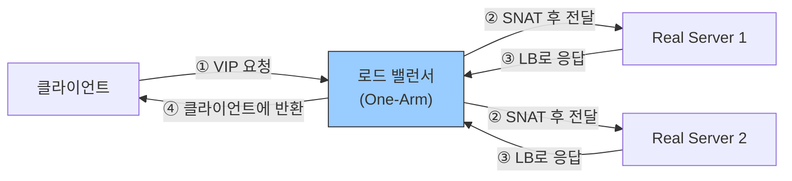
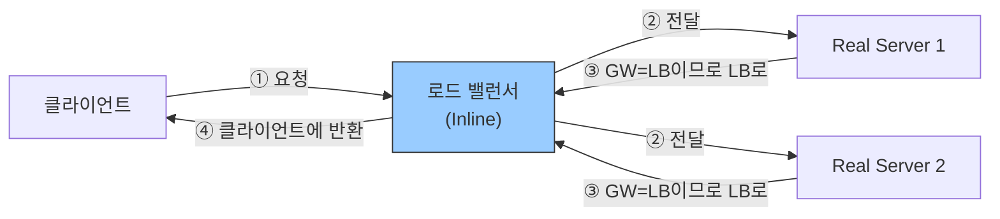
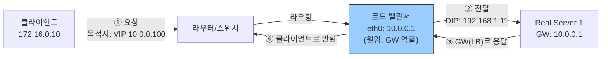
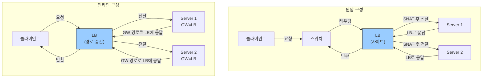
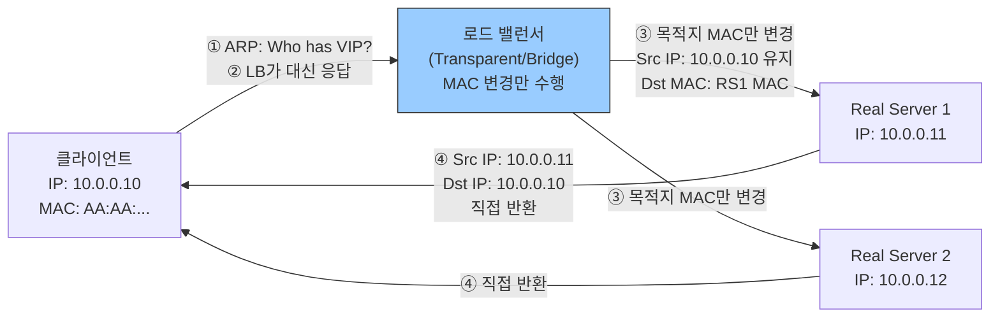
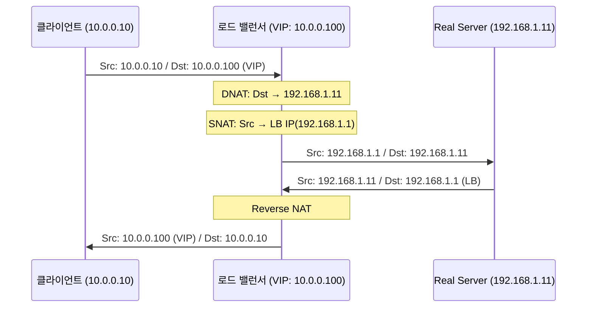
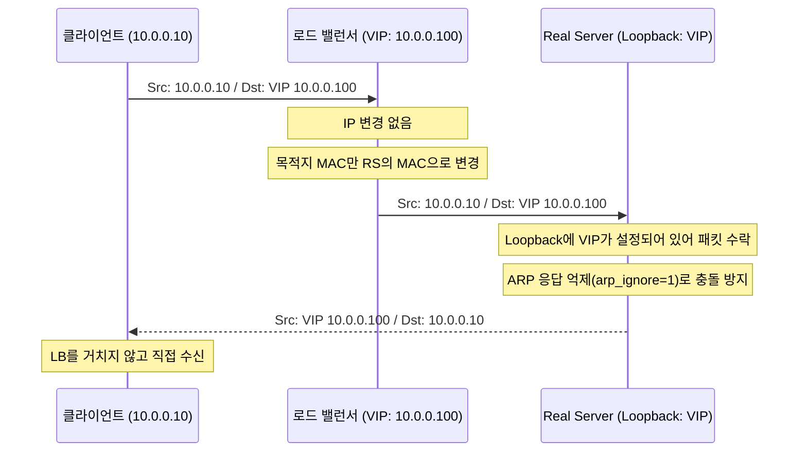
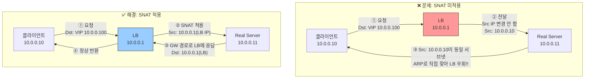
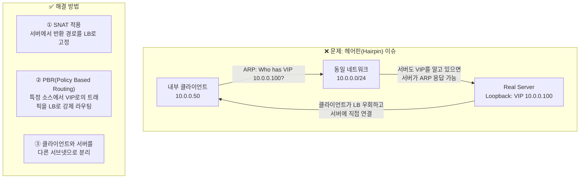

# 로드 밸런서 구성 방식

로드 밸런서가 네트워크에 **물리적으로 어떻게 배치**되는지를 나타내는 개념. 트래픽 경로를 어떻게 설계하느냐에 따라 원암과 인라인으로 구분됨.

## 원암(One-Arm) 구성

LB가 네트워크 경로 **외부에 위치**하는 구성. LB가 하나의 인터페이스(또는 VLAN)를 통해 클라이언트 트래픽을 수신하고, 동일 인터페이스로 서버에 전달하며, 서버 응답도 LB를 통해 클라이언트에 반환됨.

서버의 기본 게이트웨이를 변경할 필요가 없어 **기존 네트워크에 최소한의 변경**으로 도입 가능.



- **SNAT 필수**: LB가 클라이언트 Source IP를 LB 자신의 IP로 변환. 서버 응답이 클라이언트로 직접 가지 않고 LB를 거치도록 강제
- 요청과 응답 모두 LB를 통과 → LB가 병목이 될 수 있음
- 인라인 구성에 비해 LB 장애 시 기존 경로로 복구가 쉬움

## 인라인(Inline) 구성

LB가 클라이언트와 서버 사이의 **물리적 경로에 직렬로 위치**하는 구성. 모든 트래픽이 반드시 LB를 통과하며, 서버의 기본 게이트웨이를 LB로 설정하는 방식이 일반적.



- 서버의 **기본 게이트웨이 = LB**로 설정. 별도 SNAT 없이도 응답이 LB를 경유함
- LB가 모든 트래픽을 볼 수 있어 세션 추적, 보안 정책 적용이 용이
- LB가 단일 장애점(SPOF)이 되므로 이중화 필수

### 참고: 물리적 원암, 논리적 인라인 구성

물리 인터페이스는 하나지만(원암), 서버의 기본 게이트웨이를 LB로 설정하여 **응답 트래픽도 LB를 경유**하도록 구성. SNAT 없이 원암 구성을 인라인처럼 운영하는 방식.



> 물리적 원암이지만 서버 입장에서는 LB가 게이트웨이이므로, 응답 트래픽도 LB를 통과함. SNAT 없이 원본 클라이언트 IP를 서버에서 볼 수 있음.

## 원암 vs 인라인 비교

| 항목 | 원암(One-Arm) | 인라인(Inline) |
|---|---|---|
| **LB 배치** | 경로 외부 (사이드에 연결) | 경로 중간 (직렬 삽입) |
| **서버 GW 설정** | 변경 불필요 | LB를 GW로 설정 |
| **SNAT 필요 여부** | 필수 (응답 경로 강제) | 불필요 (GW 설정으로 해결) |
| **클라이언트 실IP 가시성** | 서버에서 볼 수 없음 | 서버에서 볼 수 있음 |
| **네트워크 변경 범위** | 최소 (LB만 추가) | 큼 (서버 GW 일괄 변경) |
| **기존 인프라 영향** | 낮음 | 높음 |
| **LB 장애 시** | 우회 경로 구성 가능 | 서비스 전면 중단 위험 |
| **SPOF 위험** | 상대적으로 낮음 | 높음 (이중화 필수) |
| **세션/정책 가시성** | 제한적 | 완전한 트래픽 통제 |
| **적합한 환경** | 기존 네트워크 도입, 유연한 배치 필요 시 | 완전한 트래픽 제어, 보안 정책 필요 시 |



---

# 로드 밸런서 동작 모드

LB가 패킷을 **어떤 방식으로 처리하여 서버에 전달**하는지를 나타내는 개념. 구성 방식(배치)과 독립적으로 선택 가능.

## Transparent 또는 Bridge

LB가 **L2 브리지처럼 투명하게 동작**하는 모드. 클라이언트와 서버는 동일 L2 세그먼트에 있는 것처럼 통신하며, LB의 존재를 인식하지 못함.



- **IP 주소 변환 없음**: 서버는 클라이언트의 실제 IP를 그대로 수신
- LB는 목적지 MAC 주소만 변경하여 패킷을 적절한 서버로 포워딩
- 서버 응답은 LB를 거치지 않고 클라이언트로 직접 전달 (DSR과 유사한 응답 경로)
- 서버의 기본 게이트웨이 변경 불필요
- **단점**: LB가 L2 경로에 물리적으로 삽입되어야 하므로 네트워크 토폴로지 변경 필요. STP/루프 주의

## Routed

LB가 **L3 라우터처럼 동작**하며 SNAT을 수행하는 모드. 클라이언트 측 서브넷과 서버 측 서브넷이 분리되어 있거나, 원암 구성에서 응답 경로를 LB로 강제할 때 사용.



- **SNAT 수행**: 서버는 클라이언트 실제 IP를 볼 수 없음. L7 LB라면 `X-Forwarded-For` 헤더로 보완
- 서버의 기본 게이트웨이 설정에 무관하게 응답이 LB로 귀환
- 클라이언트 측 / 서버 측 서브넷을 완전히 분리할 수 있어 보안 정책 적용 용이
- 요청·응답 모두 LB를 통과하므로 LB가 대역폭 병목이 될 수 있음

## DSR (Direct Server Return)

**요청은 LB 경유, 응답은 서버에서 클라이언트로 직접 전송**하는 모드. 응답이 LB를 우회하므로, 응답 데이터가 요청보다 훨씬 큰 서비스(동영상 스트리밍, 파일 다운로드 등)에서 LB 부하를 대폭 줄일 수 있음.



**DSR 구현 방법 비교**:

| 방식 | 원리 | 특징 |
|---|---|---|
| **L2 DSR** | LB가 목적지 MAC만 변경하여 서버로 전달 | 클라이언트·LB·서버가 같은 L2 세그먼트에 있어야 함 |
| **IP-IP 터널링** | LB가 원본 패킷을 IP 터널로 캡슐화하여 전달 | 서버가 다른 서브넷에 있어도 가능. 서버에 터널 인터페이스 설정 필요 |

**서버 설정 (L2 DSR)**:
- Loopback(또는 가상 인터페이스)에 VIP 추가: 서버가 VIP로 들어온 패킷을 수락하기 위함
- ARP 응답 억제 필수: 서버가 VIP에 대해 ARP 응답을 하면 LB와 충돌 발생

```bash
# Linux 서버 설정 예시 (L2 DSR)
ip addr add 10.0.0.100/32 dev lo          # Loopback에 VIP 추가
sysctl net.ipv4.conf.lo.arp_ignore=1       # ARP 요청 무시
sysctl net.ipv4.conf.lo.arp_announce=2     # ARP 응답 억제
```

**DSR 제약사항**:
- L7 로드 밸런싱(HTTP 헤더 기반 분배, SSL 오프로드) 불가. 패킷 내용을 변경할 수 없기 때문
- 서버별 설정 변경 필요
- 포트 변환(DNAT) 불가 (VIP 포트 = 서버 포트여야 함)

---

# 로드 밸런서 유의사항

## 원암 구성의 동일 네트워크 사용 시

LB, 클라이언트, 서버가 **모두 같은 서브넷**에 있고 SNAT을 적용하지 않으면, 서버 응답이 LB를 우회하여 클라이언트로 직접 전달되는 문제가 발생함.



- **원인**: 서버와 클라이언트가 같은 서브넷에 있으면 서버가 ARP로 클라이언트를 직접 찾아 응답. LB를 경유하지 않아 세션 테이블 불일치 발생 → 클라이언트에서 RST(연결 초기화) 발생
- **해결**: LB에서 SNAT 적용. 서버는 응답을 항상 LB에게 보내게 됨

## 동일 네트워크 내에서 서비스 IP (VIP) 호출

클라이언트와 VIP가 **같은 서브넷에 있을 때** 클라이언트가 VIP로 접속하는 경우, 트래픽이 LB를 거치지 않고 서버로 직접 전달되는 문제가 발생할 수 있음.



- 내부 서버가 자기 자신의 VIP로 API 호출하는 **루프백 호출(loopback call)** 시에도 동일 문제 발생
- DSR 구성에서는 서버 Loopback에 VIP가 설정되어 있어, 내부 클라이언트의 ARP 요청에 서버가 응답해버리는 상황이 생길 수 있음 → `arp_ignore` 설정 필수
- **근본 해결**: 서비스 VIP를 외부 접속용으로만 사용하고, 내부 서버 간 통신에는 Real IP(서버 실제 IP)를 사용하도록 설계
